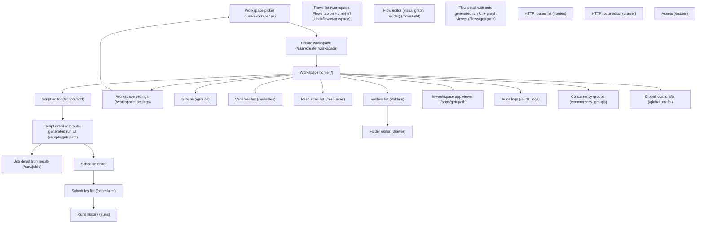

# Product specification — widndmill-test
> Generated from heal/state/spec.json — do not hand-edit. Scope: Windmill — developer platform: scripts, flows, schedules, apps

_Badges: 🟡 inferred · 🔵 documented · 🟢 confirmed · 🔴 drifted._

## Personas
- **Developer** — A new developer signing in to Windmill for the first time to write and schedule a small script. 🔵
- **Admin** — Workspace admin: can manage users, groups, settings within a workspace. 🔵
- **Operator** — Read-only / run-only workspace member: can execute scripts/flows/apps but not create or edit. 🔵
- **Superadmin** — Instance-level superadmin: manages global users, instance groups, instance settings. 🔵

## Screen-flow map

## Level-0 user journeys
### `dev-onboards-script-to-schedule` — A new developer ships a scheduled Python script end-to-end 🟢
*As a new developer, I sign in to Windmill, create a workspace, write a small Python script, run it from the auto-generated UI, schedule it on a cron, and verify the scheduled run appears in the runs history — so I can prove the platform supports the full author-to-schedule loop.*
Persona: Developer · Entry: [object Object]
1. undefined _(workspace-create)_
2. undefined _(home)_
3. undefined _(script-editor)_
4. undefined _(run-page)_
5. undefined _(job-detail)_
6. undefined _(schedule-editor)_
7. undefined _(schedules-list)_
8. undefined _(runs-history)_

### `ops-builds-flow-with-resources` — An ops engineer composes a resource+variable-driven flow and fires it via an HTTP route 🟢
*As an ops-minded developer, I add a Resource and a Variable, author a Python script that consumes both, compose a 2-step flow that calls that script, expose the flow via an HTTP route, fire the route, and inspect the resulting job — so I can prove the full configure → compose → trigger → inspect loop works end-to-end.*
Persona: Developer · Entry: [object Object]
1. undefined _(resources-list)_
2. undefined _(variables-list)_
3. undefined _(script-editor)_
4. undefined _(flow-editor)_
5. undefined _(flow-detail)_
6. undefined _(routes-list)_
7. undefined _(route-editor)_
8. undefined _(routes-list)_
9. undefined _(runs-history)_
10. undefined _(job-detail)_

### `admin-sets-up-team` — An admin stands up a team workspace, invites a teammate, organises them into a group + folder, and reviews activity in audit logs 🟢
*As a workspace admin, I create a new team workspace, switch into it, invite a teammate via Workspace Settings, create a group on /groups and add the teammate as a member, create a folder on /folders, drop a small resource into f/<folder>/ to prove the folder ACL is wired, then navigate to /audit_logs and verify the prior mutations appear as rows — so I can prove the platform supports the full provision → permission → audit loop a team admin owns.*
Persona: Admin · Entry: [object Object]
1. undefined _(workspace-picker)_
2. undefined _(workspace-create)_
3. undefined _(home)_
4. undefined _(workspace-settings)_
5. undefined _(groups)_
6. undefined _(groups)_
7. undefined _(folders-list)_
8. undefined _(folders-list)_
9. undefined _(audit-logs)_

### `builder-ships-internal-app` — A builder turns a script into a low-code app, publishes it, and shares it with a group 🟢
*As a developer wearing the builder hat, I take an existing Python script, wrap it in a low-code app whose button invokes the script and surfaces the result, publish the app, then create a group, grant the group write access to the app, and confirm the published app still renders for the owner — so I can prove the platform supports the full script -> app -> share-with-group loop a builder owns.*
Persona: Developer · Entry: [object Object]
1. undefined _(script-editor)_
2. undefined _(app-viewer)_
3. undefined _(app-viewer)_
4. undefined _(groups)_
5. undefined _(app-viewer)_
6. undefined _(app-viewer)_
7. undefined _(app-viewer)_

### `execute-pendingstests` — A developer executes a script and confirms the pending run completes undefined
*As a developer, I open a script in my workspace, execute it, and confirm the pending run completes successfully in the runs history — so I can prove a script authored in the editor becomes an executable job whose result is observable end-to-end.*
Persona: Developer · Entry: [object Object]
1. undefined _(script-editor)_
2. undefined _(run-page)_
3. undefined _(runs-history)_

## Features
### `workspaces` · Workspaces 🔴
#### `W01` · Create a new workspace from the picker and land on Home 🟢
*As a new developer with no workspace yet, I click '+ Create a new workspace' on /user/workspaces, submit a workspace name and ID, and land on the workspace home so I can use feature routes.*
Path: `workspace-picker → workspace-create → home`
1. On /user/workspaces (title 'Workspace Selection | Windmill', h1 'Select a workspace'), click the link '+ Create a new workspace'
2. On /user/create_workspace (h1 'New Workspace'), fill 'Workspace name' with 'Acme'
3. Fill 'Workspace ID' with a slug matching ^\w+(-\w+)*$ (e.g. 'acme-<rand>')
4. Click the button 'Create workspace'
5. Land on / (Workspace home) — localStorage.workspace is now set to the chosen ID
- **W01.S1** Given I am a signed-in developer with no workspace selected
And I am on /user/workspaces
When I click the '+ Create a new workspace' link
And I fill 'Workspace name' with 'Acme'
And I fill 'Workspace ID' with 'acme-<rand>'
And I click 'Create workspace'
Then I land on /
And localStorage.workspace equals 'acme-<rand>' 🟢
- **W01.S2** Given I am on /user/create_workspace
When I fill 'Workspace ID' with 'Invalid ID!'
Then the form rejects the value and the 'Create workspace' button is disabled 🟢
- **W01.S3** Given I am a non-superadmin on Community Edition
And I already own 2 workspaces outside of 'admins'
When I POST /api/workspaces/create with a new workspace
Then the request is rejected with HTTP 400
And the error reads 'You have reached the maximum number of workspaces (2 outside of default workspace \'admins\') without an enterprise license.' 🟢

#### `W02` · Pick an existing workspace from the picker 🟢
*As a developer with one or more existing workspaces, I open /user/workspaces and click a workspace tile to select it, landing on Home with that workspace as the active one.*
Path: `workspace-picker → home`
1. On /user/workspaces (h1 'Select a workspace'), under the h2 'Workspaces' section, see one button per workspace I belong to (accessible name pattern e.g. 'Admins\n-\nadmins\nas superadmin …')
2. Click the workspace tile button for the workspace I want
3. Land on / — localStorage.workspace is set to that workspace's slug
- **W02.S1** Given I am signed in and I belong to workspace 'admins'
And I am on /user/workspaces
When I click the workspace tile labeled 'Admins - admins as superadmin'
Then I land on /
And localStorage.workspace equals 'admins' 🟢

#### `W03` · Accessing a (logged) feature route without localStorage.workspace redirects to the picker 🟢
*As a developer whose browser has no localStorage.workspace yet (fresh sign-in or cleared storage), I navigate to any (logged) feature route and am redirected to /user/workspaces to select or create one first.*
Path: `workspace-picker`
1. Clear localStorage.workspace (and sessionStorage.workspace)
2. Navigate to any (logged) feature route (e.g. /scripts/add, /, /runs, /schedules, /workspace_settings)
3. Be redirected to /user/workspaces?rd=<URL-encoded-intended-route> (h1 'Select a workspace')
- **W03.S1** Given I am signed in
And localStorage.workspace is empty
When I navigate to /scripts/add
Then I land on /user/workspaces?rd=/scripts/add 🟢

#### `W04` · Edit workspace name and color from Workspace Settings 🔴
*As a workspace admin, I open /workspace_settings → General, change the workspace name and color, and see the new values reflected in the workspace selector and sidebar.*
Path: `home → workspace-settings`
1. From Home, navigate to /workspace_settings?tab=general (sidebar Settings → Workspace, or direct URL)
2. Confirm h1 'Workspace settings: <workspace-id>' and h2 'General'
3. Change the 'Workspace name' field (e.g. to 'Acme Renamed')
4. Optionally change 'Workspace color' / 'Workspace ID'
5. Save — the change is recorded server-side (audit_log kind=Update), and the workspace selector reflects the new name and color
- **W04.S1** Given I am signed in as a non-admin member of workspace 'acme'
When I navigate to /workspace_settings
Then the 'Workspace name' input is not editable (admin-only sections are hidden) undefined
- **W04.S2** Given I am a workspace admin on /workspace_settings
When I change the workspace name to 'Acme Renamed' and Save
Then POST /api/w/<id>/workspaces/change_workspace_name succeeds with 200
And an audit log entry of kind Update is recorded 🔴

#### `W05` · Add a user to the workspace (admin) 🔴
*As a workspace admin, I open Workspace Settings → Users, click 'Add new user', enter an email and pick a role, and the new member or pending invite is visible on the Users tab.*
Path: `home → workspace-settings`
1. On /workspace_settings?tab=users (default landing tab; h2 'Members (<n>)' + 'Operator settings')
2. Click the 'Add new user' button
3. Enter the user's email and pick a role (operator / developer / admin)
4. Submit the dialog — the action either adds the user immediately or sends an invite, depending on whether the email belongs to an existing Windmill user
5. On success the new row references the email in the page (member row or 'Invites' section)
- **W05.S1** Given I am a non-admin operator in workspace 'acme'
When I POST /api/w/acme/workspaces/invite_user
Then the response is HTTP 403 undefined
- **W05.S2** Given Windmill is running on Community Edition
And I am a superadmin
When I POST /api/w/admins/workspaces/invite_user with a non-admin email
Then the response is HTTP 400 with an EE-only error message undefined

#### `W06` · Leave a workspace (non-admin member) 🔴
*As a NON-ADMIN member of a workspace I no longer need, I leave it from Workspace Settings; admin owners cannot leave their own workspace and must archive or delete it instead.*
Path: `home → workspace-settings → workspace-picker`
1. Precondition: I am a non-admin member of the workspace (not the owner / admin)
2. From /workspace_settings, click the 'Leave workspace' button (only rendered for non-admin members)
3. Confirm the destructive action
4. POST /api/w/<id>/workspaces/leave returns 200; land on /user/workspaces; the workspace is no longer in my list
- **W06.S1** Given I am a NON-ADMIN member of workspace 'acme'
When I POST /api/w/acme/workspaces/leave
Then the response is HTTP 200
And my user row in workspace 'acme' is removed 🔴

#### `W07` · Archive a workspace (admin) 🟢
*As a workspace admin, I open /workspace_settings → Advanced and archive the workspace; subsequent (logged) routes for that workspace become inaccessible until a superadmin unarchives it.*
Path: `home → workspace-settings → workspace-picker`
1. On /workspace_settings?tab=advanced, click 'Archive workspace'
2. Confirm the destructive action — POST /api/w/<id>/workspaces/archive returns 200
3. Land on /user/workspaces — the workspace is hidden from non-superadmin pickers; superadmin can unarchive via POST /workspaces/unarchive/<id>
- **W07.S1** Given I am a non-admin member of workspace 'acme'
When I POST /api/w/acme/workspaces/archive
Then the response is HTTP 403 undefined
- **W07.S2** Given workspace 'acme' is archived
And I am a superadmin
When I POST /workspaces/unarchive/acme
Then the response is HTTP 200
And 'acme' reappears in the workspace picker for its members undefined

### `scripts` · Scripts (Python/TS/Go/Bash editor & runs) 🟢
#### `S01` · Author and deploy a Python script from the workspace home 🟢
*As a developer in a fresh workspace, I open the Script editor from Home, pick Python, replace the body with a no-arg hello-windmill script, and Deploy — landing on the script detail page with its auto-generated run UI.*
Path: `home → script-editor → run-page`
1. From Home, click the 'Script' CTA — /scripts/add redirects to /scripts/edit/u/<owner>/draft_<uuid>
2. In the Language picker, click 'Python'
3. Replace the editor body with `def main():\n    return 'hello windmill'` and wait for 'Saved'
4. Click the 'Deploy' button — land on /scripts/get/<scriptPath>

#### `S02` · Author and deploy a TypeScript (bun) script from Home 🟢
*As a developer, I open the Script editor from Home and pick the TypeScript (bun) language; the editor body switches to the bun template, and after replacing it with a no-arg hello-windmill script I Deploy and land on the script detail page with its auto-generated run UI.*
Path: `home → script-editor → run-page`
1. From Home, click the 'Script' CTA — lands on /scripts/edit/u/<owner>/draft_<uuid> with Python selected by default
2. In the Language picker, click the 'TypeScript (Bun)' tile — the editor body is replaced with the bun template
3. Replace the editor body with `export async function main() { return 'hello windmill' }` and wait for the 'Autosave status' to read 'Saved'
4. Click the 'Deploy' button — land on /scripts/get/<scriptPath> with the auto-generated run form visible
- **S02.S1** Given I am a developer on the Script editor from Home
When I click the 'TypeScript (Bun)' tile in the Language picker
And I replace the editor body with a no-arg hello-windmill bun script
And I click the 'Deploy' button
Then I land on the /scripts/get/<path> detail page
And the auto-generated run form is visible 🟢

#### `S03` · Edit an existing script's body and re-deploy to create a new version 🟢
*As a developer, I open a previously deployed script's detail page, click Edit to land on the editor at its workspace path, modify the body, click Deploy again, and the script detail page reflects the new content with a new hash recorded in version history.*
Path: `run-page → script-editor → run-page`
1. On the script detail page (/scripts/get/<path>), click the 'Edit' button — navigate to /scripts/edit/<path>
2. Modify the editor body (e.g. change the return string) and wait for 'Saved'
3. Click 'Deploy' — a confirmation modal may appear if other deployers have edits to merge
4. Land back on /scripts/get/<path> with the new body in effect; a new hash entry is recorded in the version history
- **S03.S1** Given I have a deployed script at 'u/admin/scripts-s03-<rand>' returning 'v1'
When I open its detail page and click Edit
And I change the body to return 'v2'
And I click Deploy
Then I land on the script detail page for that path
And the editor of that script shows the new body returning 'v2' 🟢

### `flows` · Flows (multi-step workflows) 🔵
#### `F01` · Author and deploy a 2-step Python flow from Home 🔵
*As a developer in a fresh workspace, I open the Flow editor from Home, add a first Python step that returns a value, add a second Python step that echoes its parent step's result back, and click Deploy — landing on /flows/get/<flowPath> with the auto-generated RunForm and the graph viewer of my two-step flow.*
Path: `home → flow-editor → flow-detail`
1. From Home, click the 'Flow' CTA (CreateActionsFlow) — the 'Create a new flow' modal opens with two tiles: 'Flow Editor' and 'Workflow-as-Code'
2. Click the 'Flow Editor' tile — navigate to /flows/add, which redirects via makeDraftAddLoad to /flows/edit/u/<owner>/draft_<uuid>?new_draft=true
3. From the FlowBuilder graph's '+' inserter, pick 'Action' → add an inline Python script step (step 1) whose body is `def main():\n    return 'hello'` and wait for autosave
4. Click the next '+' inserter and add a second inline Python step (step 2) whose body is `def main(prev):\n    return prev` with input_transform on `prev` referencing step 1's result
5. Click the 'Deploy' button (FlowBuilder → DeployButton) — FlowService.createFlow is called against /api/w/<w_id>/flows/create
6. Land on /flows/get/<flowPath> with the auto-generated RunForm and a FlowGraphViewer showing two ordered step nodes
- **F01.S1** Given I am a developer on Home in a fresh workspace
When I click the 'Flow' CTA and pick 'Flow Editor' in the modal
And I land on /flows/edit/u/<owner>/draft_<uuid>?new_draft=true
And I add a first inline Python step returning 'hello'
And I add a second inline Python step echoing step 1's result
And I click the 'Deploy' button
Then FlowService.createFlow is called (POST /api/w/<w_id>/flows/create) and returns 201
And I land on /flows/get/<flowPath>
And the FlowGraphViewer renders two ordered step nodes 🟢
- **F01.S2** Given I am signed in as a workspace operator
When I POST /api/w/<w_id>/flows/create with a valid NewFlow payload
Then the response is HTTP 403 with message 'Operators cannot create flows for security reasons' 🔵

#### `F02` · Run a deployed flow from its detail page 🟢
*As a developer on a deployed flow's detail page, I submit the auto-generated RunForm; the JobService.runFlowByPath call goto's /run/<jobId>, where the FlowProgressBar and FlowStatusViewer render the run completing with a Success status.*
Path: `flow-detail → job-detail`
1. On /flows/get/<flowPath>, fill the auto-generated RunForm (no args for a no-arg flow) and click the 'Run' button
2. The page calls JobService.runFlowByPath against POST /api/w/<w_id>/jobs/run/f/<flowPath> and goto's /run/<jobId>
3. On /run/<jobId>, verify the h1 'run/<jobId>' is visible
4. Verify the FlowProgressBar renders (job_kind === 'flow' branch) and the FlowStatusViewer shows per-step completion
5. Verify the job-status badge renders as the green Check (Success) once both steps complete
- **F02.S1** Given I have a deployed flow at <flowPath>
And I am on /flows/get/<flowPath>
When I click the 'Run' button on the auto-generated RunForm
Then POST /api/w/<w_id>/jobs/run/f/<flowPath> returns 201 with a jobId
And I land on /run/<jobId>
And the FlowProgressBar renders the flow's modules
And the job-status badge ends as the green Check (Success) 🟢

#### `F03` · Edit an existing flow and re-deploy with a new step appended 🟢
*As a developer iterating on a deployed flow, I open the flow detail page, click 'Edit' to land on /flows/edit/<flowPath>, append a third inline Python step from the InsertModule popover, click Deploy, and the detail page reflects the new 3-step graph.*
Path: `flow-detail → flow-editor → flow-detail`
1. On /flows/get/<flowPath> for a 2-step flow, click the 'Edit' button (DetailPageHeader → button labelled 'Edit') — navigate to /flows/edit/<flowPath>
2. From the trailing '+' inserter on the graph, pick 'Action' → add a third inline Python step
3. Wait for autosave, then click the 'Deploy' button — FlowService.updateFlow is called against /api/w/<w_id>/flows/update/<path>
4. Land back on /flows/get/<flowPath> with a 3-step FlowGraphViewer; a new entry is recorded in the flow's version history
- **F03.S1** Given I have a deployed 2-step flow at <flowPath>
When I open /flows/get/<flowPath> and click the 'Edit' button
And I land on /flows/edit/<flowPath>
And I add a third inline Python step from the InsertModule popover
And I click 'Deploy'
Then POST /api/w/<w_id>/flows/update/<flowPath> returns 200
And I land on /flows/get/<flowPath>
And the FlowGraphViewer now renders 3 ordered step nodes 🟢

#### `F04` · Delete a flow from its detail page menu 🟢
*As a developer cleaning up an unused flow, I open /flows/get/<flowPath>, open the actions menu, click 'Delete', and the flow is removed from the workspace (DELETE /api/w/<id>/flows/delete/<path>); subsequent GETs at the path 404.*
Path: `flow-detail → home`
1. On /flows/get/<flowPath>, open the actions menu in the DetailPageHeader
2. Click the 'Delete' menu item (red, Trash icon) — FlowService.deleteFlowByPath is called against DELETE /api/w/<w_id>/flows/delete/<flowPath>
3. A 'Flow deleted' toast appears; the page goto's '/' (Home)
4. Verify the Flows sub-tab on Home (/?kind=flow#workspace) no longer lists <flowPath>
- **F04.S1** Given I have a deployed flow at <flowPath>
And I am on /flows/get/<flowPath>
When I open the actions menu and click 'Delete'
Then DELETE /api/w/<w_id>/flows/delete/<flowPath> returns 200
And I land on '/'
And the Home Flows sub-tab no longer lists <flowPath> 🟢

#### `F05` · View a flow run's per-step status in the graph 🟢
*As a developer reviewing a flow run, I open /run/<jobId> for a completed flow job; the FlowStatusViewer renders the flow's sub-graph with per-module status (Success / Failure / Running) so I can see which step finished or failed.*
Path: `job-detail`
1. Trigger a flow run from /flows/get/<flowPath> — land on /run/<jobId>
2. Verify the FlowProgressBar renders (job_kind === 'flow' branch in run/+page.svelte)
3. Verify the FlowStatusViewer renders below, showing one status node per module in job.flow_status.modules
4. Verify each module node's status icon corresponds to JobStatusIcon's enum (green Check = Success, red X = Failure, yellow Play = Running, gray Ban = Canceled)
- **F05.S1** Given I just ran a 2-step flow at <flowPath> successfully
And I am on /run/<jobId> for that flow job
Then the FlowProgressBar is visible
And the FlowStatusViewer renders one node per module in job.flow_status.modules
And every module node's status icon is the green Check (Success) 🟢

### `runs-and-jobs` · Runs and job history 🔵
#### `R01` · Run a deployed script from its auto-generated UI and see Success 🟢
*As a developer on a freshly deployed script, I submit the auto-generated Run form and land on the job-detail page, where the run renders as a green Check status badge and the 'Result' panel contains my script's return value.*
Path: `run-page → job-detail`
1. On /scripts/get/<scriptPath>, fill the auto-generated RunForm and click the 'Run' button
2. The page calls JobService.runScriptByHash (or runScriptByPath for hub scripts) and goto's /run/<jobId>
3. On /run/<jobId>, verify the h1 'run/<jobId>' is visible, the status renders as the green Check badge (Success), and the 'Result' panel contains the script's return value ('hello windmill')
- **R01.S1** Given I have a deployed script at <scriptPath> that returns 'hello windmill'
And I am on /scripts/get/<scriptPath>
When I click the 'Run' button on the auto-generated RunForm
Then I land on /run/<jobId>
And the h1 'run/<jobId>' is visible
And the job-status badge renders as the green Check (Success)
And the 'Result' panel contains 'hello windmill' 🟢

#### `R02` · Find a completed run in the runs history 🟢
*As a developer who just ran (or scheduled) a script, I navigate to /runs from the sidebar and see at least one successful row for my script in the runs history table (rendered as a green Check icon link, not a literal 'Success' label).*
Path: `runs-history`
1. Navigate to /runs from the sidebar
2. Verify the page h1 'Runs' is visible
3. Verify the runs table renders columns 'Duration', 'Path', 'Triggered by'
4. Verify at least one row whose 'Path' column references <scriptPath> is visible, with a green Check status badge
- **R02.S1** Given I just ran script <scriptPath> successfully (jobId known)
When I navigate to /runs from the sidebar
Then the h1 'Runs' is visible
And the runs table renders columns 'Duration', 'Path', and 'Triggered by'
And a row whose Path column references <scriptPath> is visible
And that row's status badge is the green Check (Success) 🟢

#### `R03` · Filter runs history by status 🔵
*As a developer triaging recent activity, I open the Status filter on /runs and pick 'Success' (or 'Failure', 'Running'); the runs table narrows to only matching rows.*
Path: `runs-history`
1. Navigate to /runs from the sidebar
2. Open the 'Status' filter in the FilterSearchbar and choose 'Success'
3. Verify the URL is updated (the filter is URL-synced) and that all visible rows render the green Check badge
4. Switch the Status filter to 'Failure' — only rows with the red X badge remain (or the empty-state 'No jobs found for the selected filters.' appears if none exist)
- **R03.S1** Given I am on /runs
And at least one successful run for <scriptPath> exists
When I open the 'Status' filter and pick 'Success'
Then every row visible in the runs table renders the green Check status badge
And a row referencing <scriptPath> is visible 🟢
- **R03.S2** Given the /runs page
When I open the 'Status' filter
Then the only available options are: All, Running, Success, Failure, Canceled, Waiting, Suspended 🔵

#### `R04` · Filter runs history by runnable path 🟢
*As a developer wanting to see only this script's runs, I either navigate to /runs/<scriptPath> directly or set the 'Path' filter on /runs; the table narrows to rows whose Path column matches that runnable.*
Path: `runs-history`
1. Navigate to /runs/<scriptPath> (the route's initialPath param pre-seeds the Path filter)
2. Verify the h1 'Runs' is visible and the 'Path' filter chip shows <scriptPath>
3. Verify every visible row's 'Path' column references <scriptPath>
4. Clear the Path filter — unrelated rows reappear
- **R04.S1** Given I have a deployed script at <scriptPath> with at least one completed run
When I navigate to /runs/<scriptPath>
Then the h1 'Runs' is visible
And the Path filter is set to <scriptPath>
And every visible row's 'Path' column references <scriptPath> 🟢

#### `R05` · Cancel a running job from its detail page 🟢
*As a developer who launched a long-running script, I open /run/<jobId> while it is still running, click 'Cancel', and the job's status flips to the gray Ban (Canceled) badge.*
Path: `run-page → job-detail`
1. Launch a script that runs long enough to observe (e.g. one that sleeps a few seconds) from /scripts/get/<scriptPath> — land on /run/<jobId>
2. While the status badge is the yellow Play (Running), click the 'Cancel' button
3. The frontend POSTs /api/w/<w_id>/jobs_u/queue/cancel/<jobId>
4. After the cancel completes, the status badge flips to the gray Ban (Canceled)
- **R05.S1** Given I am on /run/<jobId> and the job is still Running (yellow Play badge)
When I click the 'Cancel' button
Then POST /api/w/<w_id>/jobs_u/queue/cancel/<jobId> returns 200
And the status badge flips to the gray Ban (Canceled) 🟢
- **R05.S2** Given /run/<jobId> for a job whose state is 'CompletedJob'
When I view the action row
Then no 'Cancel' button is rendered 🟢

#### `R06` · Re-run a completed job from its detail page 🟢
*As a developer reviewing a completed run, I click 'Run again' on /run/<jobId> to re-execute the same runnable; the script-run page is reopened with the original args pre-filled, and an immediate 'Run immediately with same args' dropdown option queues a fresh job in one click.*
Path: `job-detail → run-page → job-detail`
1. On /run/<jobId> for a completed script (job_kind == 'script' or 'flow'), locate the 'Run again' button
2. Click 'Run again' — the page goto's /scripts/get/<scriptHash>#<sharableArgsHash>, re-opening the auto-generated RunForm with the original args pre-filled
3. (Alternatively, open the 'Run again' dropdown and pick 'Run immediately with same args' to queue a new job without revisiting the form)
4. Submit the form — a new /run/<newJobId> page is loaded with its own status badge
- **R06.S1** Given I am on /run/<jobId> for a completed script run of <scriptPath>
When I click the 'Run again' button
Then the page navigates to /scripts/get/<scriptHash>#<argsHash>
And the RunForm is pre-populated with the original args
When I click 'Run' on that form
Then I land on /run/<newJobId> for a new job whose script_path is <scriptPath> 🟢

#### `R07` · View a failed job and see the error in the Result panel 🟢
*As a developer debugging a broken script, I open /run/<jobId> for a failed run; the status renders as the red X badge and the 'Result' panel contains the error payload (DisplayResult renders the failure object).*
Path: `job-detail`
1. Run a script that throws an error (e.g. `throw new Error('boom')`) from /scripts/get/<scriptPath>
2. Land on /run/<jobId>
3. Verify the status badge is the red X (Failure)
4. Verify the 'Result' panel is visible and contains the error payload (the script's thrown message, as rendered by DisplayResult)
- **R07.S1** Given I have a deployed script at <scriptPath> that throws 'boom'
When I run it from /scripts/get/<scriptPath>
And I land on /run/<jobId>
Then the status badge is the red X (Failure)
And the 'Result' panel is visible
And the rendered result contains 'boom' 🟢

### `schedules` · Schedules (cron) 🔵
#### `SC01` · Schedule a deployed script on a cron from its Triggers panel 🟢
*As a developer on a deployed script, I open Triggers → Add trigger → Schedule, set a cron in the schedule editor, and save — closing the editor with the schedule attached to the script.*
Path: `run-page → schedule-editor`
1. On /scripts/get/<scriptPath>, switch to the 'Triggers' tab in the script-detail panel
2. Click 'Add trigger' and pick 'Schedule' from the chooser
3. In the schedule editor, fill the Cron textbox with '* * * * *'
4. Click 'Save' — the schedule editor heading is hidden and the schedule is attached to the script
- **SC01.S1** Given I am on /scripts/get/<scriptPath> for a freshly deployed script
And the 'Triggers' tab is open
When I click 'Add trigger' and pick 'Schedule'
And I fill the Cron textbox with '* * * * *'
And I click 'Save'
Then the schedule editor closes
And a schedule with that cron is attached to <scriptPath> 🟢
- **SC01.S2** Given I am on the schedule editor for a deployed script
When I fill the Cron textbox with 'not a cron'
And I click 'Save'
Then the save fails with a cron-validation error
And no schedule row is created for that path 🟢

#### `SC02` · See a created schedule listed on /schedules 🟢
*As a developer who just created a schedule, I navigate to /schedules from the sidebar and see a row whose cron expression matches what I saved.*
Path: `schedules-list`
1. Navigate to /schedules from the sidebar
2. Verify the Schedules heading is visible
3. Verify a row referencing the saved cron expression is visible
- **SC02.S1** Given I created a schedule at 'u/admin/sc02-<rand>' on cron '* * * * *' for script <scriptPath>
When I navigate to /schedules from the sidebar
Then the Schedules heading is visible
And a row referencing 'u/admin/sc02-<rand>' with cron '* * * * *' is visible 🟢

#### `SC03` · Create a schedule from the standalone /schedules page 🔵
*As a developer who already has a deployed script, I navigate to /schedules, click 'New schedule', pick the script, fill a cron, and save — a row for the new schedule appears in the list.*
Path: `schedules-list → schedule-editor → schedules-list`
1. From Home, navigate to /schedules (sidebar 'TRIGGERS' → 'Schedules'); confirm title 'Schedules | Windmill' and h1 'Schedules'
2. Click the 'New schedule' button — the schedule editor opens with sections 'Metadata', 'Schedule', 'Runnable', 'Advanced'
3. Under 'Runnable', click the 'Pick a script' input and select an existing deployed script
4. Under 'Schedule', fill the 'Cron' field (placeholder '0 0 */1 * * *') with '0 9 * * *' and leave the suggested 'Timezone' (e.g. 'Europe/Paris')
5. Under 'Metadata', leave the 'u/admin@windmill.dev' path prefix and type a unique name into the 'schedule' textbox (e.g. 'sc03-<rand>')
6. Click the 'Save' button — the editor closes
7. A row referencing 'u/admin@windmill.dev/sc03-<rand>' is visible in the schedules list
- **SC03.S1** Given I have a deployed script at <scriptPath>
And I am on /schedules
When I click 'New schedule'
And I pick <scriptPath> in the script picker
And I fill the Cron textbox with '0 9 * * *'
And I set the schedule path to 'u/admin/sc03-<rand>'
And I click 'Save'
Then a row with path 'u/admin/sc03-<rand>' and cron '0 9 * * *' is visible in /schedules 🟢
- **SC03.S2** Given a schedule at path 'u/admin/sc03-dup' already exists
When I POST /api/w/<id>/schedules/create with the same path
Then the response is HTTP 4xx (conflict / unique violation)
And no new schedule row is added 🔵

#### `SC04` · Toggle a schedule's enabled state from /schedules 🔵
*As a developer who owns a schedule, I flip its enabled toggle on the /schedules row; the cron immediately stops (or resumes) firing without otherwise modifying the schedule.*
Path: `schedules-list`
1. On /schedules, locate the row of a schedule I own that is currently enabled
2. Click the enabled toggle in that row
3. The toggle flips to 'off' and the row reflects the disabled state
4. Click the toggle again — the schedule is re-enabled
- **SC04.S1** Given schedule 'u/admin/sc04-<rand>' is enabled on /schedules
When I click the enabled toggle on that row
Then POST /api/w/<id>/schedules/setenabled/u/admin/sc04-<rand> returns 200
And the row reflects the disabled state 🟢
- **SC04.S2** Given schedule 'u/alice/sc04-<rand>' belongs to alice
And I am signed in as bob who lacks 'schedules:write:u/alice/sc04-<rand>'
When I POST /api/w/<id>/schedules/setenabled/u/alice/sc04-<rand>
Then the response is HTTP 403 🔵

#### `SC05` · Edit a schedule's cron from /schedules 🟢
*As a developer, I open an existing schedule from /schedules, change its cron expression in the editor, and save — the schedules list reflects the new cron.*
Path: `schedules-list → schedule-editor → schedules-list`
1. On /schedules, click the Edit affordance (row click or dropdown → Edit) for a schedule I own
2. The schedule editor opens pre-filled with the existing cron
3. Change the Cron textbox value (e.g. from '* * * * *' to '*/5 * * * *')
4. Click 'Save'
5. The editor closes and the row's cron column now shows '*/5 * * * *'
- **SC05.S1** Given schedule 'u/admin/sc05-<rand>' exists with cron '* * * * *'
And I am on /schedules
When I open its Edit affordance
And I change the Cron textbox to '*/5 * * * *'
And I click 'Save'
Then POST /api/w/<id>/schedules/update/u/admin/sc05-<rand> returns 200
And the row's cron column shows '*/5 * * * *' 🟢

#### `SC06` · Delete a schedule from /schedules 🟢
*As a developer who owns a schedule, I delete it from /schedules; the row disappears and the cron stops firing.*
Path: `schedules-list`
1. On /schedules, locate the row of a schedule I own
2. Open the row's dropdown / kebab menu and click 'Delete'
3. Confirm the destructive action
4. The row is no longer visible in /schedules
- **SC06.S1** Given schedule 'u/admin/sc06-<rand>' exists
And I am on /schedules
When I open the row's dropdown and click 'Delete'
And I confirm the destructive action
Then DELETE /api/w/<id>/schedules/u/admin/sc06-<rand> returns 200
And no row with that path is visible on /schedules 🟢

#### `SC07` · Trigger 'Run now' on a schedule 🟢
*As a developer who owns a schedule, I trigger an on-demand run from the /schedules row's 'Run now' action; a job is queued immediately and appears in the runs history independently of the cron.*
Path: `schedules-list → runs-history`
1. On /schedules, locate the row of a schedule I own
2. Open the row's dropdown / kebab menu and click 'Run now'
3. A job is enqueued for the schedule's script/flow with its saved args and permissioned_as identity
4. Navigate to /runs and see a new row whose runnable matches the schedule's script_path
- **SC07.S1** Given schedule 'u/admin/sc07-<rand>' targets script <scriptPath>
And I am on /schedules
When I click 'Run now' in the row's dropdown
Then a new job for <scriptPath> appears in /runs within a few seconds 🟢

### `users-and-permissions` · Users, groups and permissions 🟢
#### `UP01` · Add a new user to the workspace (admin) 🟢
*As a workspace admin, I open Workspace Settings → Users, click 'Add new user', enter an email and pick a role (Operator/Developer/Admin), and the user is added or invited so they can access the workspace at that role level.*
Path: `home → workspace-settings`
1. From Home, navigate to /workspace_settings?tab=users (sidebar 'Settings' → 'Workspace' → Users)
2. Click the 'Add new user' button
3. Enter the user's email and pick a role (Operator, Developer, or Admin)
4. Submit — the row references the new user's email on the Users tab
- **UP01.S1** Given I am an admin on /workspace_settings?tab=users
When I click 'Add new user'
And I fill the email with 'newop-<rand>@example.com' and pick 'Operator'
And I submit the dialog
Then a row referencing 'newop-<rand>@example.com' is visible in the Users table 🟢
- **UP01.S2** Given I am a non-admin member of workspace 'acme'
When I POST /api/w/acme/users/add
Then the response is HTTP 403 undefined

#### `UP02` · Change a workspace user's role (admin) 🟡
*As a workspace admin, I open the Users tab and click a role chip (Operator / Developer / Admin) in the row of an existing member to change their workspace role; the row reflects the new role immediately.*
Path: `home → workspace-settings`
1. On /workspace_settings?tab=users, find the row of an existing non-admin member
2. Click the role chip you want to assign (Operator / Developer / Admin) on that row
3. The selected chip becomes the active selection on the row
4. POST /api/w/<id>/users/update/<username> records the new role
- **UP02.S1** Given I am an admin on /workspace_settings?tab=users
And user 'op@example.com' has the Operator role in this workspace
When I click the 'Developer' role chip in op@example.com's row
Then the 'Developer' chip becomes the active selection on that row undefined

#### `UP03` · Self-demotion prevention — admin cannot demote themselves 🟡
*As an admin viewing my own row on the Users tab, the role chips for Operator/Developer are disabled (or block my click) so I cannot accidentally demote myself out of admin and lock myself out of the workspace.*
Path: `home → workspace-settings`
1. On /workspace_settings?tab=users, find my own row
2. Attempt to click the 'Operator' or 'Developer' role chip on my own row
3. The click is rejected or the chips are visibly disabled — my row stays at 'Admin'
- **UP03.S1** Given I am an admin viewing /workspace_settings?tab=users
When I attempt to set my own row's role to 'Operator'
Then the change is rejected (UI disabled or 'Ask another admin' prompt) undefined

#### `UP04` · Create a workspace group 🟢
*As a workspace admin, I open the Groups page, click the 'New group' popover, enter a name, and the new group appears in the groups list.*
Path: `home → groups`
1. From Home, navigate to /groups (sidebar 'Folders & Groups' → Groups)
2. On /groups (title 'Groups | Windmill', h1 'Groups'), click the 'New group' button
3. Enter a unique group name in the popover's name input
4. Submit the popover — POST /api/w/<id>/groups/create returns 201
5. A new row referencing the new group's name is visible on /groups
- **UP04.S1** Given I am an admin on /groups
When I open the new-group popover and enter 'engineers-<rand>'
And I submit the popover
Then a row referencing 'engineers-<rand>' is visible on the Groups page 🟢
- **UP04.S2** Given a group named 'engineers' already exists in workspace 'acme'
When I POST /api/w/acme/groups/create with name 'engineers'
Then the response is HTTP 4xx (conflict / unique violation) undefined

#### `UP05` · Add a member to a workspace group 🟡
*As a workspace admin, I open an existing group, add a workspace user as a member, and the member is listed in the group's roster.*
Path: `home → groups`
1. On /groups, click the row of an existing workspace group
2. In the group editor drawer, open the members section
3. Add an existing workspace user by email
4. POST /api/w/<id>/groups/adduser/<name> returns 200; the user is listed as a member
- **UP05.S1** Given workspace 'acme' contains user 'op@example.com' and group 'engineers'
And I am an admin on /groups
When I open the 'engineers' group editor
And I add 'op@example.com' as a member
Then 'op@example.com' is listed under 'engineers' members in the page undefined

#### `UP06` · Delete a workspace group 🟢
*As a workspace admin, I delete a group from the Groups page; the group row disappears from the list.*
Path: `home → groups`
1. On /groups, locate the group I want to delete
2. Open the row's dropdown / kebab menu and click 'Delete'
3. Confirm the destructive action
4. DELETE /api/w/<id>/groups/delete/<name> returns 200; the group is gone from the list
- **UP06.S1** Given group 'engineers' exists in workspace 'acme'
And I am an admin on /groups
When I open the dropdown for 'engineers' and click 'Delete'
And I confirm the action
Then the 'engineers' row is no longer visible on /groups 🟢

#### `UP07` · Toggle the auto-add (or auto-invite) setting for the workspace 🟡
*As a workspace admin, I open the Users tab and use the 'Auto-add: OFF/ON' toggle to control whether new users with a matching email domain are automatically added (or invited) to the workspace.*
Path: `home → workspace-settings`
1. On /workspace_settings?tab=users, find the 'Auto-add: OFF' or 'Auto-invite: OFF' button
2. Click it to open the popover
3. Toggle the master enable switch ON; optionally restrict by email domain and pick a default role
4. POST /api/w/<id>/settings/edit_auto_invite returns 200; the button now reads 'Auto-add: ON' (or 'Auto-invite: ON')
- **UP07.S1** Given I am an admin on /workspace_settings?tab=users with auto-add off
When I open the 'Auto-add: OFF' popover
And I enable the master toggle and pick 'Operator' as the default role
And I save the popover
Then the toggle button now reads 'Auto-add: ON' (or 'Auto-invite: ON' in cloud mode) undefined

### `variables-and-resources` · Variables and resources 🟢
#### `VR01` · Create a non-secret variable under u/<me>/ 🟡
*As a developer, I create a non-secret variable scoped to my user path (u/<me>/<name>); the variable appears in the /variables list with its value visible (non-secret).*
Path: `home → variables-list`
1. From Home, navigate to /variables (sidebar Variables)
2. Click the 'New variable' / create-variable button
3. Fill the path field with 'u/<me>/<name>' (auto-validated against ^[ug](/[\w-]+){2,}$)
4. Leave 'Secret' OFF
5. Optionally fill description and labels
6. Submit — a row referencing the new variable's path is visible in the list with the value rendered
- **VR01.S1** Given I am a developer on /variables
When I create a non-secret variable at 'u/admin/vr01-<rand>' with value 'hello'
Then a row with path 'u/admin/vr01-<rand>' is visible in the variables table
And the value column for that row shows 'hello' undefined
- **VR01.S2** Given I am on the create-variable form
When I fill the path with 'tmp/whatever' (an invalid prefix)
Then the form's path validator rejects the value and submission is blocked undefined

#### `VR02` · Create a secret variable; value is masked in the list 🟢
*As a developer, I create a secret variable; when I view the /variables list, the value column for that row is masked (e.g. shows '••••' or is blank) even though the underlying value exists.*
Path: `home → variables-list`
1. From Home, navigate to /variables
2. Click the 'New variable' button
3. Fill path 'u/<me>/<name>' and a non-empty value
4. Toggle the 'Secret' switch ON
5. Submit — the new row is visible in the list
6. Confirm the value cell for the row is masked / blank (the list endpoint returns value=null for is_secret=true)
- **VR02.S1** Given I am a developer on /variables
When I create a SECRET variable at 'u/admin/vr02-<rand>' with value 'topsecret'
Then a row with path 'u/admin/vr02-<rand>' is visible in the table
And the value cell for that row is masked (no literal 'topsecret' shown) 🟢

#### `VR03` · Delete a variable 🟡
*As a developer, I delete a variable I own; the row disappears from the list.*
Path: `home → variables-list`
1. On /variables, locate the row of the variable I own
2. Open its action menu (kebab/dropdown) and click 'Delete'
3. Confirm the destructive action
4. DELETE /api/w/<id>/variables/delete/<path> returns 200; the row is no longer visible
- **VR03.S1** Given variable 'u/admin/vr03-<rand>' exists
And I am on /variables
When I open the action menu for that row and click 'Delete'
And I confirm the destructive action
Then no row with path 'u/admin/vr03-<rand>' is visible in the table undefined

#### `VR04` · Create a resource using an existing resource type 🟡
*As a developer, I create a resource of an existing type (e.g. 'postgresql') and fill its fields per the type's JSON schema; the resource appears in the /resources list.*
Path: `home → resources-list`
1. From Home, navigate to /resources (title 'Resources | Windmill'; default tab 'Workspace' shows the resources table)
2. Click the 'Add resource' button
3. In the resource editor, pick an existing resource type from the type chooser
4. Fill the SchemaForm fields required by the type
5. Submit — a row referencing the new resource's path is visible in the Resources table
- **VR04.S1** Given a resource type 'postgresql' exists in this workspace
And I am a developer on /resources (Resources tab)
When I create a new resource at 'u/admin/vr04-<rand>' of type 'postgresql' with all required fields filled
And I submit the form
Then a row with path 'u/admin/vr04-<rand>' is visible in the Resources table undefined

#### `VR05` · Delete a resource 🟡
*As a developer, I delete a resource I own; the row disappears from the Resources list.*
Path: `home → resources-list`
1. On /resources, locate the row of the resource I own
2. Open its action menu (dropdown) and click 'Delete'
3. Confirm the destructive action
4. DELETE /api/w/<id>/resources/delete/<path> returns 200; the row is gone
- **VR05.S1** Given resource 'u/admin/vr05-<rand>' of type 'postgresql' exists
And I am on /resources
When I open the action menu for that row and click 'Delete'
And I confirm the destructive action
Then no row with path 'u/admin/vr05-<rand>' is visible in the Resources table undefined

#### `VR06` · Create a workspace-scoped resource type (admin) 🟡
*As a workspace admin, I open the 'Resource Types' tab on /resources, create a new resource type with a JSON Schema, and the new type appears in the type list and is available when creating resources.*
Path: `home → resources-list`
1. On /resources, click the 'Resource Types' tab
2. Click the 'Add resource type' button
3. Fill the type name and provide a JSON Schema (object with properties)
4. Submit — POST /api/w/<id>/resources/type/create returns 200; the new type appears in the Resource Types table
- **VR06.S1** Given I am an admin on /resources → 'Resource Types' tab
When I create a new resource type named 'vr06-<rand>' with a JSON Schema {"type":"object","properties":{"host":{"type":"string"}},"required":["host"]}
Then a row referencing the new type name is visible in the Resource Types table undefined
- **VR06.S2** Given I am a non-admin developer in workspace 'acme'
When I POST /api/w/acme/resources/type/create
Then the response is HTTP 403 undefined

### `folders` · Folders 🟢
#### `FD01` · Create a folder from /folders 🟢
*As a developer/admin, I open /folders, click 'New folder', type a name in the popover, hit 'Create', and the new folder appears as a row in the folders table (the editor drawer also opens in place for follow-up configuration).*
Path: `home → folders-list → folder-editor`
1. From Home, navigate to /folders (sidebar 'Folders & Groups' → 'Folders')
2. Confirm title 'Folders | Windmill' and h1 'Folders'
3. Click the 'New folder' button (Popover trigger)
4. Type a name matching ^[a-zA-Z_0-9-]+$ into the 'New folder name' input
5. Click the popover 'Create' button — POST /api/w/<id>/folders/create returns 200; the FolderEditor drawer opens with title 'Folder <name>'
6. Close the drawer — the new folder row is visible in the table (Name cell contains the folder name)
- **FD01.S1** Given I am a developer on /folders
When I click 'New folder'
And I fill 'New folder name' with 'fd01-<rand>'
And I click 'Create'
Then the FolderEditor drawer opens with title 'Folder fd01-<rand>'
And a row whose Name cell contains 'fd01-<rand>' is visible in the folders table 🟢
- **FD01.S2** Given I am a developer
When I POST /api/w/admins/folders/create with body {"name":"bad/name"}
Then the response is HTTP 400
And the error message reads 'Folder name can only contain alphanumeric characters, underscores, and hyphens' undefined

#### `FD02` · Add a group member to a folder from the FolderEditor drawer 🟢
*As a folder owner, I open a folder's editor drawer, switch the User|Group toggle to 'Group', pick a group (e.g. 'all'), click 'Grant', and the group appears in the Permissions table for the folder.*
Path: `home → folders-list → folder-editor`
1. On /folders, click the row of a folder I own (or click 'Manage folder' in its kebab) — the FolderEditor drawer opens with title 'Folder <name>'
2. Locate the 'Permissions (<n>)' section
3. Click the 'Group' option of the User|Group ToggleButtonGroup
4. Open the Select and pick a workspace group (e.g. 'all')
5. Click 'Grant' — POST /api/w/<id>/acls/add/folder/<name> with {"owner":"g/all"} returns 200 (the FolderEditor uses GranularAclService.addGranularAcls under the hood; this writes to extra_perms with role=writer, NOT to the owners array)
6. Confirm the Permissions table now contains a row 'g/all' (the section header becomes 'Permissions (2)')
- **FD02.S1** Given folder 'fd02-<rand>' exists in workspace 'admins'
And I open the FolderEditor drawer for fd02-<rand>
When I switch the User|Group toggle to 'Group', pick group 'all', and click 'Grant'
Then a subsequent GET /api/w/admins/folders/get/fd02-<rand> returns extra_perms containing key 'g/all'
And the FolderEditor drawer renders 'g/all' in the Permissions table
And the Permissions section header reads 'Permissions (2)' 🟢

#### `FD03` · Delete a folder from /folders 🟢
*As a folder owner, I open the row's kebab menu, click 'Delete', and the folder row disappears from the list (DELETE /folders/delete/<name> returns 200; subsequent GET returns 404).*
Path: `home → folders-list`
1. Precondition: a folder I own exists
2. On /folders, find the row for that folder
3. Open the row's kebab/dropdown menu (last cell of the row)
4. Click 'Delete' — the row is optimistically removed from the table
5. DELETE /api/w/<id>/folders/delete/<name> returns 200; GET /folders/get/<name> returns 404
6. After a refresh, the folder is gone from the listing
- **FD03.S1** Given folder 'fd03-<rand>' exists
And I am on /folders
When I open the row's kebab menu and click 'Delete'
Then GET /api/w/admins/folders/get/fd03-<rand> returns HTTP 404
And no row whose Name cell contains 'fd03-<rand>' is visible in the folders table 🟢

#### `FD04` · A script deployed under f/<folder>/ is counted in the folder's usage and visible in its detail 🟢
*As a developer, I deploy a script at path f/<folder>/<name> and the script is reported as owned by the folder: the folder's usage endpoint counts it under scripts, and the row in /folders shows a non-zero 'Scripts' cell.*
Path: `home → folders-list`
1. Precondition: folder 'fd04-<rand>' exists
2. Deploy a Python script at path 'f/fd04-<rand>/myscript' (POST /api/w/<id>/scripts/create)
3. GET /api/w/<id>/folders/getusage/fd04-<rand> returns { scripts: 1, ... }
4. On /folders, the row for 'fd04-<rand>' shows '1' in the Scripts column
- **FD04.S1** Given folder 'fd04-<rand>' exists
And a deployed Python script exists at 'f/fd04-<rand>/myscript'
When I GET /api/w/admins/folders/getusage/fd04-<rand>
Then the response body has scripts >= 1
And on /folders the row whose Name cell contains 'fd04-<rand>' shows '1' in the Scripts column 🟢

### `triggers` · Triggers (HTTP routes & webhooks) 🔵
#### `T01` · Create an HTTP route from /routes that targets a deployed script 🟢
*As a developer with a deployed script, I open /routes from the sidebar, click 'New route', pick the script as the runnable, set a unique route path and an HTTP method (default POST), and Save — a row for the new route appears in the list and its canonical URL ('/api/r/<workspace>/<route_path>') invokes the script when called.*
Path: `home → routes-list → route-editor → routes-list`
1. From Home, navigate to /routes (sidebar TRIGGERS → 'HTTP'); confirm PageHeader title 'Custom HTTP routes'
2. Click the 'New route' button — the RouteEditor drawer opens
3. In the drawer, fill 'Summary' with a short label and leave the 'Path' field at its auto-generated 'u/<me>/route-<rand>'
4. Under 'Target' (Runnable selected by default), use the ScriptPicker to pick an existing deployed script
5. Under 'HTTP', fill the 'Path' (route_path) text input with a unique slug (e.g. 't01-<rand>') and leave http_method on 'POST'
6. Click 'Save' — the drawer closes
7. A row referencing the trigger path appears at /routes with the canonical URL containing POST and the route_path
- **T01.S1** Given I have a deployed script at <scriptPath> returning 'hello'
And I am on /routes
When I click 'New route'
And I pick <scriptPath> in the runnable ScriptPicker
And I fill the route_path 'Path' textbox with 't01-<rand>'
And I leave http_method on 'POST'
And I click 'Save'
Then the drawer closes
And a row with route_path 't01-<rand>' is visible at /routes
And POSTing to /api/r/<workspace_id>/t01-<rand> returns the script's result 'hello' 🟢

#### `T02` · Edit the HTTP method of an existing route 🔵
*As a workspace admin (only admins on non-workspaced routes may change path/method/prefix), I open an existing route from /routes, switch its http_method ToggleButtonGroup from 'POST' to 'GET', save, and the row reflects the new method.*
Path: `routes-list → route-editor → routes-list`
1. On /routes, click the row anchor (or the Edit button) of a route I own — the RouteEditor drawer opens pre-filled
2. Under 'HTTP', the http_method ToggleButtonGroup currently shows 'POST' selected; click 'GET'
3. Click 'Save' — the drawer closes
4. The row's canonical URL now starts with 'GET'
- **T02.S1** Given route at trigger path 'u/admin/t02-<rand>' exists with http_method 'POST'
And I am on /routes
When I open its Edit affordance
And I click 'GET' in the http_method ToggleButtonGroup
And I click 'Save'
Then the drawer closes
And the row's displayed method is 'GET' 🟢
- **T02.S2** Given route A exists with route_path 't02-dup' and http_method 'POST'
When I create or edit route B with the same route_path 't02-dup' and http_method 'POST' (same workspace_id / workspaced_route)
Then the request is rejected with HTTP 400 and error 'A route already exists with this path'
And route B is not persisted 🔵

#### `T03` · Delete an HTTP route from /routes 🟢
*As a developer who owns a route, I open the row's dropdown on /routes, click 'Delete', and the row disappears — the canonical URL stops resolving (404 from the route_job router).*
Path: `routes-list`
1. On /routes, locate the row of a route I own
2. Open the row's kebab dropdown and click 'Delete'
3. The deletion calls HttpTriggerService.deleteHttpTrigger and a 'Successfully deleted HTTP route: <path>' toast appears
4. The list reloads without the deleted row; calling /api/r/<workspace_id>/<route_path> now returns 404
- **T03.S1** Given route at trigger path 'u/admin/t03-<rand>' exists with route_path 't03-<rand>'
And I am on /routes
When I open the row's dropdown and click 'Delete'
Then the row for 'u/admin/t03-<rand>' is no longer visible
And POSTing to /api/r/<workspace_id>/t03-<rand> returns HTTP 404 🟢

#### `T04` · Invoke a deployed script via its auto-generated webhook URL 🟢
*As a developer, I open the Triggers tab on a deployed script's detail page, copy the synchronous webhook URL from the Webhooks panel, POST a payload to it with a valid token, and see a corresponding row in /runs whose runnable matches the script_path.*
Path: `run-page → runs-history`
1. On /scripts/get/<scriptPath>, switch to the 'Triggers' tab in the right pane
2. Pick the default 'Webhooks' trigger — the WebhooksPanel renders under a 'Webhooks' section with the documentation link 'webhooks'
3. From WebhooksConfigSection, copy the 'sync' webhook URL: '<origin>/api/w/<workspace_id>/jobs/run_wait_result/p/<scriptPath>'
4. Issue a POST to that URL with an Authorization Bearer header carrying a workspace token and an empty JSON body
5. Response is the script's result; navigate to /runs and see a new row whose runnable matches <scriptPath>
- **T04.S1** Given I have a deployed script at <scriptPath> returning 'hello'
When I POST to '<origin>/api/w/<workspace_id>/jobs/run_wait_result/p/<scriptPath>' with a valid Bearer token and empty JSON body
Then the response body is 'hello'
And a row whose runnable matches <scriptPath> appears in /runs 🟢

#### `T05` · Toggle an HTTP route's enabled state from /routes 🟢
*As a developer who owns a route, I flip its TriggerModeToggle on the /routes row from 'enabled' to 'disabled'; the route stops accepting traffic (incoming requests 404) without otherwise modifying it, and I can flip it back.*
Path: `routes-list`
1. On /routes, locate the row of a route I own whose TriggerModeToggle is currently 'enabled'
2. Click the toggle — the page calls HttpTriggerService.setHttpTriggerMode with mode='disabled' and a 'Disabled HTTP trigger <path>' toast appears
3. Calling the route's URL now returns HTTP 404 (the disabled row is excluded from the matchit router cache)
4. Click the toggle again to re-enable the route
- **T05.S1** Given route at trigger path 'u/admin/t05-<rand>' with route_path 't05-<rand>' is enabled
And I am on /routes
When I click the TriggerModeToggle on that row
Then HttpTriggerService.setHttpTriggerMode is called with mode 'disabled' and returns 200
And the row reflects the disabled state
And POSTing to /api/r/<workspace_id>/t05-<rand> returns HTTP 404 🟢

### `apps` · Apps (low-code UI builder) 🔵
#### `A01` · Create and deploy a minimal app via API; viewer mounts at /apps/get/<path> 🟢
*As a developer, I POST a minimal app value to /apps/create (the builder is too fragile to author end-to-end). The new row appears in the workspace; navigating to /apps/get/<path> mounts the InWorkspaceAppViewer (the parent Svelte page is on-origin, the app's own markup loads in the /app_embed iframe) and the page <title> reflects the app's path.*
Path: `home → app-viewer`
1. API: POST /api/w/<wid>/apps/create with { path, summary, value: { grid: [], hiddenInlineScripts: [], css: {}, norefreshbar: false }, policy: { execution_mode: 'viewer' } } — backend returns 201 and the path
2. Navigate to /apps/get/<path>; the InWorkspaceAppViewer mounts (its #app-edit-btn wrapper renders once getAppLiteByPath resolves writer permission for the seeded admin)
3. The page <title> contains 'App <path>'
4. API: GET /api/w/<wid>/apps/get/p/<path> returns the deployed row with the posted summary
- **A01.S1** Given a seeded admin in workspace 'admins'
When I POST a minimal app value to /api/w/admins/apps/create at path 'u/admin/a01-<rand>' with summary 'A01 <rand>'
Then the response is 201 and body is the app path
And GET /api/w/admins/apps/get/p/u/admin/a01-<rand> returns the deployed row with summary 'A01 <rand>'
And navigating to /apps/get/u/admin/a01-<rand> mounts the InWorkspaceAppViewer (the document <title> contains 'App u/admin/a01-<rand>') 🟢

#### `A02` · Deployed app with a button-runnable runs its inline script and the result is observable 🔵
*As a developer, I deploy an app whose value contains a single buttoncomponent backed by an inline Python script. The app row + its inline runnable are persisted with the app, and re-fetching the app via /apps/get/p/<path> returns the inline script content embedded in the AppValue — proving the button is wired end-to-end to a runnable that the in-workspace viewer would invoke on click.*
Path: `app-viewer`
1. API: POST /api/w/<wid>/apps/create with a value containing a single buttoncomponent whose componentInput.runnable.inlineScript returns 'hello-<rand>'
2. Navigate to /apps/get/<path>; the InWorkspaceAppViewer mounts and the document <title> contains 'App <path>'
3. API: GET /apps/get/p/<path> — the returned value.grid[0].data.componentInput.runnable.inlineScript.content contains the tagged payload 'hello-<rand>'
- **A02.S1** Given a seeded admin in workspace 'admins'
When I POST an app at 'u/admin/a02-<rand>' whose value has a single buttoncomponent with an inline Python script returning 'hello-<rand>'
Then the response is 201
And GET /apps/get/p/u/admin/a02-<rand> returns the app with grid[0].data.componentInput.runnable.inlineScript.content containing 'hello-<rand>'
And /apps/get/u/admin/a02-<rand> mounts the viewer (document <title> contains 'App u/admin/a02-<rand>') 🟢
- **A02.S2** Given a deployed app at 'u/admin/a02-<rand>' with a single buttoncomponent backed by an inline Python script returning 'hello-<rand>'
When I navigate to /apps/get/u/admin/a02-<rand> and click the rendered button
Then a sandboxed run is enqueued (POST /apps_u/execute_component/<path>) and the result 'hello-<rand>' is rendered inside the app's component output 🔵

#### `A03` · Edit a deployed app's summary via API and re-deploy 🟢
*As a developer, I update a deployed app's `summary` (and bump its value) via POST /apps/update/<path>. A new app_version row is created; GET /apps/get/p/<path> returns the new summary; the viewer page at /apps/get/<path> still mounts on the same path.*
Path: `app-viewer`
1. API: POST /apps/create with summary 'A03 <rand> v1'
2. API: POST /apps/update/<path> with summary 'A03 <rand> v2' (and an unchanged minimal value, mutated only by the slug-stamped description so the content hash changes)
3. API: GET /apps/get/p/<path> — summary is now 'A03 <rand> v2'
4. Navigate to /apps/get/<path>; the viewer page mounts (<title> contains 'App <path>')
- **A03.S1** Given an app deployed at 'u/admin/a03-<rand>' with summary 'A03 <rand> v1'
When I POST to /api/w/admins/apps/update/u/admin/a03-<rand> with summary 'A03 <rand> v2'
Then the response is OK
And GET /apps/get/p/u/admin/a03-<rand> returns summary 'A03 <rand> v2'
And navigating to /apps/get/u/admin/a03-<rand> still mounts the viewer page 🟢

#### `A04` · Delete an app via API; /apps/get/p/<path> returns 404 and the row is gone from /apps/list 🟢
*As a developer, I DELETE a deployed app. The row is removed from the workspace listing; GET /apps/get/p/<path> returns 404; navigating to /apps/get/<path> in the viewer surfaces the notExists branch (no document <title> match).*
Path: `app-viewer`
1. API: POST /apps/create at 'u/admin/a04-<rand>'
2. API: DELETE /apps/delete/u/admin/a04-<rand>
3. API: GET /apps/list — the path is no longer in the response
4. API: GET /apps/get/p/u/admin/a04-<rand> returns 404 'App not found at path'
- **A04.S1** Given an app deployed at 'u/admin/a04-<rand>'
When I DELETE /api/w/admins/apps/delete/u/admin/a04-<rand>
Then the response is OK
And GET /api/w/admins/apps/list does not contain a row at 'u/admin/a04-<rand>'
And GET /api/w/admins/apps/get/p/u/admin/a04-<rand> returns HTTP 404 🟢

### `raw-apps` · Raw apps (HTML/JS bundles) 🔵
#### `RA01` · Create a raw HTML/JS app via /apps/create_raw and the viewer mounts at /apps_raw/get/<path> 🟢
*As a developer, I POST a minimal raw-app bundle (index.html + index.js) to /apps/create_raw. The row is persisted in the `app` table with `raw_app: true`; GET /apps/get/p/<path> returns the round-tripped bundle bytes; navigating to /apps_raw/get/<path> mounts the InWorkspaceAppViewer (the same viewer the low-code /apps/get route uses) and the document <title> reflects the app path.*
Path: `app-viewer`
1. API: POST /api/w/<wid>/apps/create_raw multipart with `app` = { path, summary, value: { files: { 'index.html': { code }, 'index.js': { code } }, runnables: {} }, policy: { execution_mode: 'viewer' } }, `js` = the bundle, optional `css` — backend returns 201 and the path
2. API: GET /api/w/<wid>/apps/get/p/<path> returns raw_app=true, the posted summary, and value.files['index.html'].code containing the slug-stamped marker (round-trip proves the bytes the viewer would serve)
3. Navigate to /apps_raw/get/<path>; +page.svelte mounts InWorkspaceAppViewer keyed on `<wid>/<path>` and +page.js sets stuff.title = `App <path>`
4. The document <title> contains 'App <path>'
- **RA01.S1** Given a seeded admin in workspace 'admins'
When I POST a multipart raw-app bundle to /api/w/admins/apps/create_raw at 'u/admin/ra01-<rand>' with index.html stamped with 'hello-ra01-<rand>'
Then the response is 201 and body is the app path
And GET /api/w/admins/apps/get/p/u/admin/ra01-<rand> returns raw_app=true with the posted summary and value.files['index.html'].code containing the slug marker
And navigating to /apps_raw/get/u/admin/ra01-<rand> mounts the InWorkspaceAppViewer (document <title> contains 'App u/admin/ra01-<rand>') 🟢

#### `RA02` · Update a raw app's HTML/JS via /apps/update_raw and the new version is served 🔵
*As a developer, I update a deployed raw app's `summary`, `value` (HTML/JS), and JS bundle via POST /apps/update_raw/<path>. A new app_version row is created and appended to `app.versions`; GET /apps/get/p/<path> returns the new bytes; the viewer page still mounts on the same path.*
Path: `app-viewer`
1. API: POST /apps/create_raw at 'u/admin/ra02-<rand>' with index.html stamped 'hello-ra02-<rand>-v1' and summary 'RA02 <rand> v1'
2. API: POST /apps/update_raw/<path> multipart with `app` = { summary: 'RA02 <rand> v2', value: { files: { 'index.html': { code: ... v2 marker }, 'index.js': { code: ... } }, runnables: {} } } and a fresh `js` part
3. API: GET /apps/get/p/<path> — summary is now 'RA02 <rand> v2', value.files['index.html'].code contains the v2 marker, and versions array length increased
4. Navigate to /apps_raw/get/<path>; the viewer page mounts (<title> contains 'App <path>')
- **RA02.S1** Given a raw app deployed at 'u/admin/ra02-<rand>' with index.html containing 'hello-ra02-<rand>-v1' and summary 'RA02 <rand> v1'
When I POST a multipart update to /api/w/admins/apps/update_raw/u/admin/ra02-<rand> with summary 'RA02 <rand> v2', value.files['index.html'] stamped 'hello-ra02-<rand>-v2', and a fresh js bundle
Then the response is 200
And GET /api/w/admins/apps/get/p/u/admin/ra02-<rand> returns summary 'RA02 <rand> v2', value.files['index.html'].code containing the v2 marker, and a versions array longer than before
And navigating to /apps_raw/get/u/admin/ra02-<rand> still mounts the viewer page (<title> contains 'App u/admin/ra02-<rand>') 🟢
- **RA02.S2** Given a raw app deployed at 'u/admin/ra02pk-<rand>'
When I POST a multipart update to /apps/update_raw/u/admin/ra02pk-<rand> with `app` containing only { summary: 'v2' } (NO `value`) plus a fresh js bundle
Then the response is HTTP 400 with an app_bundles_pkey unique-constraint error (update_app_internal only inserts a new app_version when ns.value is Some, so the multipart handler tries to write the new JS against the prior version id) 🔵

#### `RA03` · Delete a raw app via /apps/delete/<path>; GET 404s and the home list no longer renders the path 🟢
*As a developer, I DELETE a deployed raw app. The shared /apps/delete/<path> handler removes the row (raw apps live in the same `app` table as low-code apps); GET /apps/get/p/<path> returns 404; the workspace Apps home tab no longer renders the path.*
Path: `app-viewer`
1. API: POST /apps/create_raw at 'u/admin/ra03-<rand>' (raw_app=true on the persisted row)
2. API: DELETE /apps/delete/u/admin/ra03-<rand> (shared with low-code apps)
3. API: GET /apps/get/p/u/admin/ra03-<rand> returns HTTP 404
4. Navigate to /?kind=app#workspace and verify the path is not rendered on the page (raw apps surface in the same Home Apps tab as low-code apps — there is no dedicated /apps_raw list route)
- **RA03.S1** Given a raw app deployed at 'u/admin/ra03-<rand>'
When I DELETE /api/w/admins/apps/delete/u/admin/ra03-<rand>
Then the response is OK
And GET /api/w/admins/apps/get/p/u/admin/ra03-<rand> returns HTTP 404
And the workspace Apps home tab at /?kind=app#workspace does not render 'u/admin/ra03-<rand>' 🟢

### `workers` · Workers and worker groups 🟢
#### `WK01` · View the /workers page and at least one live worker row 🔵
*As a developer or admin who wants to verify the cluster is healthy, I open /workers, see the 'Workers' PageHeader, observe the worker-group Tabs (default, native) each annotated with their live worker counts, and confirm the Active workers DataTable contains at least one row with a green 'Alive' Status badge.*
Path: `workers`
1. Navigate to /workers
2. Verify document title 'Workers | Windmill' (set by +page.js stuff.title = 'Workers')
3. Verify the h1 'Workers' (PageHeader title)
4. Verify a Tab whose accessible name matches /^default\s+\d+\s+workers?$/ is visible
5. Verify a Tab whose accessible name matches /^native\s+\d+\s+workers?$/ is visible
6. Verify the 'Active workers' section text is visible above the DataTable
7. Verify at least one cell renders the text 'Alive' (the green Status badge for workers with last_ping < 60s)
- **WK01.S1** Given I am signed in as 'admin@windmill.dev'
And the seeded 'admins' workspace is selected
When I navigate to /workers
Then the document title contains 'Workers'
And the h1 'Workers' is visible
And a Tab whose accessible name matches /^default\s+\d+\s+workers?$/ is visible
And a Tab whose accessible name matches /^native\s+\d+\s+workers?$/ is visible
And the text 'Active workers' is visible
And at least one row's Status cell shows 'Alive' 🟢
- **WK01.S2** Given I am signed in as an operator in a workspace whose operator_settings.workers is false
When I navigate to /workers
Then the page renders an Unauthorized banner ('Page not available for operators') and not the Workers PageHeader 🔵

#### `WK02` · Filter active workers by search query within the currently-selected group 🟢
*As an admin debugging a specific worker, I type a substring into the per-group 'Search workers in group' input; filterWorkerGroupByNames narrows the DataTable to workers whose name | instance | ip contains the query. A query that matches no worker triggers the 'No active workers found matching the search query' empty-state row.*
Path: `workers`
1. Navigate to /workers (default tab = 'default')
2. Wait for the 'Workers' h1 and the 'Active workers' subsection to render
3. Fill the textbox with placeholder `Search workers in group 'default'` with 'wk-default'
4. Verify at least one worker name containing 'wk-default' is still visible
5. Refill the search box with 'no-such-worker-zzz'
6. Verify the empty-state row 'No active workers found matching the search query' is rendered
- **WK02.S1** Given I am on /workers with at least one worker in the 'default' group
When I fill the input placeholder "Search workers in group 'default'" with 'wk-default'
Then at least one cell containing 'wk-default' is visible
When I fill the same input with 'no-such-worker-zzz'
Then the row 'No active workers found matching the search query' is visible 🟢

#### `WK03` · Switch the worker-group Tab from 'default' to 'native' and see its workers 🔵
*As an admin auditing the cluster, I click the 'native' Tab on /workers; the selected group switches to 'native', the search placeholder reflects the active group ('Search workers in group native'), and the Active workers DataTable lists the live native workers (worker names prefixed 'wk-native').*
Path: `workers`
1. Navigate to /workers
2. Wait for the 'Workers' h1
3. Click the Tab whose accessible name matches /^native\s+\d+\s+workers?$/
4. Verify the textbox placeholder is now "Search workers in group 'native'"
5. Verify 'Active workers' remains visible
6. Verify at least one row contains 'wk-native'
- **WK03.S1** Given I am on /workers and the 'native' group has at least one alive worker
When I click the Tab whose accessible name matches /^native\s+\d+\s+workers?$/
Then the textbox placeholder is "Search workers in group 'native'"
And the text 'Active workers' is visible
And at least one cell contains 'wk-native' 🟢
- **WK03.S2** Given I am signed in as a non-superadmin, non-devops user on /workers
Then the 'Manage tags', 'Queue metrics', 'New agent worker', and 'New group config' buttons are not rendered
And the per-worker 'Open repl' button is not rendered
And the 'Edit config' / 'Delete config' / 'Clean cache' / 'Restart workers' WorkerGroup actions are not actionable 🔵

### `ai-agents` · AI agents & assistants 🔵
#### `AI01` · Open the Ask AI chat panel from the sidebar (Cmd/Ctrl+L shortcut) 🔵
*As a developer working in the Windmill UI, I click the 'Ask AI' sidebar MenuButton (or press Cmd/Ctrl+L), and the AI chat panel mounts a right-side region with aria-label='AI chat'. The panel mounts regardless of provider configuration; without a wired provider it shows a disabled hint instead of accepting a prompt, but the region's chrome ('Chat' header + 'to open or close this chat' keyboard-hint footnote) still renders — so the mount path is fully testable on CE without any LLM credentials.*
Path: `home`
1. From any (logged) page, locate the sidebar MenuButton labelled 'Ask AI' (rendered in frontend/src/routes/(root)/(logged)/+layout.svelte at L613, L699, L814 — three variants for wide / narrow / legacy sidebars; each binds on:click={() => aiChatManager.toggleOpen()} and advertises shortcut Cmd/Ctrl+L)
2. Click it — aiChatManager.toggleOpen() flips chatState.size from 0 to >0 (AIChatManager.svelte.ts L347: open = $derived(chatState.size > 0))
3. The right-side panel mounts AIChat.svelte → AIChatDisplay.svelte; the outer div is role='region' aria-label='AI chat' (AIChatDisplay.svelte L488-489)
4. The panel header renders the literal text 'Chat' (L508) and the empty-state keyboard-hint footnote 'You can use ⌘L to open or close this chat, and ⌘K in the script editor to modify selected lines.' (L582-585)
5. Press Cmd/Ctrl+L again — the svelte:window onkeydown listener in AIChat.svelte L110-118 calls aiChatManager.toggleOpen(), chatState.size drops to 0, and the region unmounts
- **AI01.S1** Given I am signed in as 'admin@windmill.dev'
And the seeded 'admins' workspace is selected
And I am on the workspace home at /
When I click the sidebar MenuButton labelled 'Ask AI'
Then a region with aria-label='AI chat' is visible
And the chat header text 'Chat' is visible
And the empty-state hint matching /to open or close this chat/ is visible 🟢
- **AI01.S2** Given I am on the workspace home at /
When I press Cmd/Ctrl+L
Then a region with aria-label='AI chat' is visible
When I press Cmd/Ctrl+L again
Then no region with aria-label='AI chat' is mounted 🟢
- **AI01.S3** Given I am on the workspace home at /
And a valid AI provider is configured in workspace_settings.ai_config
When I open the AI chat panel and submit a prompt 'Hello'
Then the panel renders an assistant reply 🔵

#### `AI02` · Workspace Settings — Windmill AI tab renders provider toggles 🔵
*As a workspace admin who wants to wire Windmill AI, I navigate to /workspace_settings?tab=ai and the page renders the 'Windmill AI' SettingsPageHeader, the canonical description, and an 'AI Providers' SettingCard containing one Toggle per AI_PROVIDERS entry (OpenAI, Anthropic with a 'Recommended' Badge, Mistral, DeepSeek, Google AI, Groq, OpenRouter, Together AI, AWS Bedrock, Azure OpenAI, Custom AI). The downstream SettingCards (Default chat model, Metadata generation model, Code completion, Custom system prompts) and ModelTokenLimits block are also part of the AI tab body. All assertions here are read-only — saving a provider requires a real LLM API key resource and is out of scope on the credential-less sandbox.*
Path: `home → workspace-settings`
1. From Home, navigate to /workspace_settings?tab=ai (sidebar Settings → Workspace → Windmill AI; sidebar item defined in workspace_settings/+page.svelte L1059-1070 with id='ai', label='Windmill AI')
2. The page tab body branches on tab == 'ai' (L1828-1844) and mounts <AISettings> with the workspace's existing ai_config as initialConfig
3. AISettings.svelte (L364) renders a SettingsPageHeader with title 'Windmill AI' and description 'Windmill AI integrates with your favorite AI providers and models.'
4. An 'AI Providers' SettingCard (L388) renders one Toggle per AI_PROVIDERS key (L390); the Anthropic row is annotated with a blue 'Recommended' Badge (L421-429)
5. Below the providers card are SettingCards for 'Default chat model', 'Metadata generation model', 'Code completion', 'Custom system prompts', and a ModelTokenLimits block
- **AI02.S1** Given I am signed in as admin@windmill.dev in workspace 'admins'
When I navigate to /workspace_settings?tab=ai
Then a heading 'Windmill AI' is visible
And the text 'Windmill AI integrates with your favorite AI providers and models.' is visible
And labels for at least 'Anthropic' and 'OpenAI' providers are visible
And a 'Recommended' Badge is rendered next to the Anthropic provider toggle 🟢
- **AI02.S2** Given I am signed in as a non-admin developer in workspace 'acme'
When I POST /api/w/acme/edit_copilot_config
Then the response is HTTP 403 🔵
- **AI02.S3** Given I am an admin on /workspace_settings?tab=ai
When I pick the OpenAI toggle, attach an OpenAI API key resource, pick a model, and Save
Then POST /api/w/admins/edit_copilot_config returns 200
And workspace_settings.ai_config now contains providers.openai with the chosen resource_path 🔵

#### `AI03` · Persist a flow that contains an AI Agent step 🔵
*As a developer building an AI workflow, I create a flow whose value contains an AI Agent module ({type:'aiagent', tools:[], input_transforms:{provider,output_type,user_message}}); the backend persists the module via POST /api/w/<wid>/flows/create (AIAgent serde variant in backend/windmill-types/src/flows.rs L966-973), GET /flows/get/<path> returns the persisted aiagent module verbatim with the slug-stamped user_message round-tripped, and navigating to /flows/get/<path> mounts the flow detail page whose FlowGraphViewer renders the literal label 'AI Agent' (FlowGraphViewerStep.svelte L144-145). Running the agent end-to-end is NOT covered: that requires a real LLM provider key wired into workspace_settings.ai_config.*
Path: `flow-detail`
1. POST /api/w/admins/flows/create at path 'u/admin/ai03-<rand>' with a value containing a single module whose value matches the frontend createAiAgent() factory shape (flowStateUtils.svelte.ts L177-197): {type:'aiagent', tools:[], input_transforms:{provider:{type:'static',value:{kind:'openai',resource:'',model:''}}, output_type:{type:'static',value:'text'}, user_message:{type:'static',value:'ai03-<rand>'}}}
2. The backend deserializes via the 'aiagent' arm of the untagged FlowModuleValue deserializer (flows.rs L1104-1113); tools=[] is accepted (covered by the existing ai_agent_omit_output_from_conversation_defaults_to_false Rust unit test L1231-1245)
3. GET /api/w/admins/flows/get/u/admin/ai03-<rand> returns the persisted row; value.modules[0].value.type is 'aiagent' and input_transforms.user_message.value is the slug-stamped marker
4. Navigate to /flows/get/u/admin/ai03-<rand>; the flow detail page mounts a heading containing the flow path and the FlowGraphViewer renders the literal text 'AI Agent' for the aiagent step (FlowGraphViewerStep.svelte L144-145)
- **AI03.S1** Given I am a seeded admin in workspace 'admins'
When I POST a flow at 'u/admin/ai03-<rand>' with one module of type 'aiagent' and tools=[]
Then the response is OK
And GET /api/w/admins/flows/get/u/admin/ai03-<rand> returns a flow whose first module value.type is 'aiagent'
And the persisted user_message input_transform value matches the slug-stamped marker
And navigating to /flows/get/u/admin/ai03-<rand> mounts the flow detail page (heading contains the flow slug)
And the FlowGraphViewer renders the text 'AI Agent' 🟢
- **AI03.S2** Given a flow at 'u/admin/ai03-<rand>' with one aiagent module exists
And a valid AI provider is configured in workspace_settings.ai_config
When I POST /api/w/admins/jobs/run/f/u/admin/ai03-<rand>
Then the flow job runs the aiagent step and returns a Success result 🔵
- **AI03.S3** Given I am on /flows/edit/<path> in the FlowBuilder
When I open the InsertModule popover and click the 'AI Agent' TopLevelNode
Then a new aiagent module is appended to the flow value 🔵

### `audit-logs` · Audit logs 🟢
#### `AU01` · View the Audit logs page (h1, redaction alert, table headers) 🔵
*As an admin auditing workspace activity, I navigate to /audit_logs, see the 'Audit logs' h1, the 'You need an enterprise license to see unredacted audit logs.' Alert, and the AuditLogsTable column headers (ID | Timestamp | Username | Operation | Resource) so I can confirm the page mounts and the CE redaction state is surfaced.*
Path: `home`
1. Sign in as admin@windmill.dev and select the seeded 'admins' workspace
2. API precondition: GET /api/w/admins/audit/list?per_page=5 returns a JSON array (the backend list_audit is reachable; on CE-without-license each row has operation='redacted', resource='EE only', parameters={redacted:'-'})
3. Navigate to /audit_logs
4. Assert document title contains 'Windmill' (the (logged) layout default — audit_logs/+page.js does not override stuff.title)
5. Assert h1 'Audit logs' is visible (audit_logs/+page.svelte L92)
6. Assert the Alert 'You need an enterprise license to see unredacted audit logs.' is visible (rendered when $enterpriseLicense is falsy or ends with '_pro' — audit_logs/+page.svelte L154-158)
7. Assert each AuditLogsTable column header is visible: 'ID', 'Timestamp', 'Username', 'Operation', 'Resource' (AuditLogsTable.svelte L134-143)
- **AU01.S1** Given I am signed in as 'admin@windmill.dev'
And the seeded 'admins' workspace is selected
When I navigate to /audit_logs
Then the document title contains 'Windmill'
And the h1 'Audit logs' is visible
And the text 'You need an enterprise license to see unredacted audit logs.' is visible
And the column headers 'ID', 'Timestamp', 'Username', 'Operation', 'Resource' are visible 🟢
- **AU01.S2** Given I am signed in as an operator in a workspace whose operator_settings.audit_logs is false
When I navigate to /audit_logs
Then the page renders an Unauthorized banner ('Page not available for operators') and not the Audit logs PageHeader 🔵

#### `AU02` · Filter audit logs by action_kind 🔵
*As an admin triaging recent activity, I filter the audit log by action_kind to narrow the result set to only Create / Update / Delete / Execute rows. The backend's ACTION_KIND Postgres enum is lowercase-only — the filter rejects 'Create' (capitalised) with a SqlErr — so the AuditLogsTable badge click handler must (and does) lowercase the value before re-fetching.*
Path: `home`
1. Sign in as admin@windmill.dev
2. Create a throwaway script via POST /api/w/admins/scripts/create to guarantee at least one Create row exists in the audit log
3. GET /api/w/admins/audit/list?per_page=20&action_kind=create — every returned row's action_kind must be exactly 'Create' (the JSON response uses the un-renamed Serialize side of the enum)
4. GET /api/w/admins/audit/list?per_page=20&action_kind=delete — every returned row's action_kind must be exactly 'Delete'
5. GET /api/w/admins/audit/list?action_kind=Create (uppercase) must fail — the PG enum returns 'invalid input value for enum action_kind' and the API bubbles 5xx
- **AU02.S1** Given a fresh script create has just appended a Create row to /api/w/admins/audit/list
When I GET /api/w/admins/audit/list?per_page=20&action_kind=create
Then the response is 200 and every row's action_kind is 'Create'
When I GET /api/w/admins/audit/list?per_page=20&action_kind=delete
Then the response is 200 and every row's action_kind is 'Delete'
When I GET /api/w/admins/audit/list?action_kind=Create (capitalised)
Then the response is >=400 with an 'invalid input value for enum action_kind' error 🟢
- **AU02.S2** Given the workspace is on Windmill EE with a valid license
When I GET /api/w/admins/audit/list?operation=scripts.create
Then every returned row has operation='scripts.create' (unredacted) 🔵

#### `AU03` · Performing a script create+delete appends new audit_log rows 🔵
*As a developer who wants to prove the audit trail is wired, I snapshot the current max(id) on /audit/list, deploy and then delete a throwaway script, and re-list — at least two new rows arrive, both attributed to my username, with action_kind covering both Create and Delete. The Create row is written by windmill-api/src/scripts.rs::create_script and the Delete row by ::delete_script, each inside the same transaction as the underlying mutation.*
Path: `home`
1. Sign in as admin@windmill.dev
2. GET /api/w/admins/audit/list?per_page=1 — snapshot baselineMaxId from the most recent row (the endpoint returns rows ordered by id DESC)
3. Pre-clean any leftover script at u/admin/au03-<slug> (defensive)
4. POST /api/w/admins/scripts/create with a no-arg Python script at u/admin/au03-<slug> — appends one audit_log row with action_kind=Create
5. POST /api/w/admins/scripts/delete/p/u/admin/au03-<slug> — appends one audit_log row with action_kind=Delete
6. GET /api/w/admins/audit/list?per_page=100&username=admin@windmill.dev — filter to rows newer than baselineMaxId, assert >=2 new rows, all attributed to admin@windmill.dev, with action_kind set covering both 'Create' and 'Delete'
- **AU03.S1** Given I am signed in as admin@windmill.dev
And I have snapshotted the current max(id) from /api/w/admins/audit/list?per_page=1
When I POST /api/w/admins/scripts/create with a no-arg Python script at u/admin/au03-<slug>
And I POST /api/w/admins/scripts/delete/p/u/admin/au03-<slug>
Then GET /api/w/admins/audit/list?per_page=100&username=admin@windmill.dev returns at least 2 new rows above the baseline
And every new row's username is 'admin@windmill.dev'
And the new rows' action_kind set includes both 'Create' and 'Delete' 🟢
- **AU03.S2** Given the workspace is on Windmill EE with a valid license
When I create a script at u/admin/au03-<slug> and re-list /audit/list
Then the new Create row's operation is 'scripts.create'
And its resource field references the script path 🔵
- **AU03.S3** Given the EE feature 'audit_logs_s3' is configured
When I GET /api/settings/audit_logs_s3_status
Then the response is a non-null status object with last_xmin / last_ts cursors 🔵

### `assets` · Assets 🟢
#### `AS01` · View the Assets page and see a resource registered by a deployed script 🔵
*As a developer auditing what my scripts and flows depend on, I open /assets, see the 'Assets' PageHeader, the 'All workspace assets' cards (Data table, Ducklake, Object storage), the 'Latest assets used' DataTable, and a row for the resource I just deployed a referencing script against — with a '1 usage' link pointing at the script.*
Path: `assets-list`
1. Sign in as admin@windmill.dev and select the seeded 'admins' workspace
2. API precondition (resource): POST /api/w/admins/resources/create with {path: 'u/admin/<ns>', resource_type: 'postgresql', value: {host: 'h'}}
3. API precondition (script): POST /api/w/admins/scripts/create with a python body that calls `wmill.get_resource('u/admin/<ns>')` so the deploy-time parser writes an `asset` row (windmill-common/src/assets.rs insert_static_asset_usage). The asset row is inserted in the same transaction as scripts/create
4. Sanity GET /api/w/admins/assets/list?asset_path=<ns> returns exactly the resource we just registered (kind='resource', path='u/admin/<ns>')
5. Navigate to /assets
6. Assert the document title is 'Assets | Windmill' (+page.js stuff.title='Assets')
7. Assert the h1 'Assets' is visible (PageHeader)
8. Assert the 'All workspace assets' Section label is visible
9. Assert the 'Latest assets used' Section label is visible
10. Assert the three card titles 'Data table', 'Ducklake', 'Object storage' are visible (Volumes is folded into the Object storage card via the itemExtra Button snippet, not a separate card)
11. Assert a cell whose text contains 'u/admin/<ns>' is visible (the resource path renders unmodified — our slug is <92 chars so truncate(asset.path,92) is a no-op)
12. Assert a link labelled '1 usage' is visible in that row (we deployed exactly one script that references the resource)
13. Cleanup: scripts/delete + resources/delete (no UI cleanup path on a read-only page)
- **AS01.S1** Given I am signed in as 'admin@windmill.dev'
And the seeded 'admins' workspace is selected
And a resource at 'u/admin/<ns>' of type 'postgresql' exists
And a Python script at 'u/admin/<ns>_script' calls wmill.get_resource('u/admin/<ns>')
When I navigate to /assets
Then the document title is 'Assets | Windmill'
And the h1 'Assets' is visible
And the text 'All workspace assets' is visible
And the text 'Latest assets used' is visible
And the card titles 'Data table', 'Ducklake', 'Object storage' are visible
And a cell whose text contains 'u/admin/<ns>' is visible
And a link with accessible name '1 usage' is visible 🟢
- **AS01.S2** Given I am signed in as an operator in a workspace whose operator_settings.assets is false
When I navigate to /assets
Then the page renders an Unauthorized banner ('Page not available for operators') and not the Assets PageHeader 🔵

#### `AS02` · Filter the Assets DataTable by asset kind via URL query 🔵
*As a developer narrowing the catalog to a specific asset kind, I append ?asset_kinds=resource to /assets and see only resource-kind rows; appending ?asset_kinds=variable hides my just-deployed resource row (and on CE renders the 'No assets found' empty state because the deploy-time parser does not emit variable-kind asset rows).*
Path: `assets-list`
1. Deploy precondition (same as AS01): a postgresql resource at u/admin/<ns> plus a Python script that wmill.get_resource(<path>) so an asset row exists
2. Sanity GET /api/w/admins/assets/list?asset_kinds=resource: at least one returned row has path='u/admin/<ns>' AND every row's kind == 'resource'
3. Sanity GET /api/w/admins/assets/list?asset_kinds=variable: every row's kind == 'variable' AND our resource path is absent
4. Navigate to /assets?asset_kinds=resource
5. Assert the h1 'Assets' is visible and a cell with text 'u/admin/<ns>' is visible
6. Assert the kind-label sub-line 'Postgresql resource' is visible (formatAssetKind for kind='resource' + metadata.resource_type='postgresql' returns `${capitalize(resource_type)} resource` per assets/lib.ts L74-87)
7. Navigate to /assets?asset_kinds=variable
8. Assert the empty-state row 'No assets found' is visible (assets/+page.svelte L370) and our resource path does NOT appear
- **AS02.S1** Given a postgresql resource at 'u/admin/<ns>' is referenced by a deployed Python script
When I navigate to /assets?asset_kinds=resource
Then the h1 'Assets' is visible
And a cell whose text contains 'u/admin/<ns>' is visible
And the kind-label 'Postgresql resource' is visible
When I navigate to /assets?asset_kinds=variable
Then the empty-state row 'No assets found' is visible
And no cell whose text contains 'u/admin/<ns>' is visible 🟢
- **AS02.S2** When I GET /api/w/admins/assets/list?asset_kinds=not_a_real_kind
Then the response is 400 with message 'Invalid asset_kinds parameter' 🔵

#### `AS03` · Filter the Assets DataTable by asset_path substring 🔵
*As a developer searching the catalog for a specific asset, I append ?asset_path=<slug> to /assets and see only rows whose path matches; a guaranteed-miss slug renders the 'No assets found' empty state. asset_path is server-side ILIKE %<query>% (windmill-api-assets L143-148, L296).*
Path: `assets-list`
1. Deploy precondition (same as AS01): a postgresql resource at u/admin/<ns> + a referencing script
2. Sanity GET /api/w/admins/assets/list?asset_path=<ns>: at least one returned row has path='u/admin/<ns>'
3. Navigate to /assets?asset_path=<ns>
4. Assert the h1 'Assets' is visible and a cell with text 'u/admin/<ns>' is visible
5. Navigate to /assets?asset_path=no_such_asset_path_xyz_<ns> (a per-test unique string)
6. Assert the empty-state row 'No assets found' is visible and our resource path is absent
- **AS03.S1** Given a postgresql resource at 'u/admin/<ns>' is referenced by a deployed Python script
When I navigate to /assets?asset_path=<ns>
Then the h1 'Assets' is visible
And a cell whose text contains 'u/admin/<ns>' is visible
When I navigate to /assets?asset_path=no_such_asset_path_xyz_<ns>
Then the empty-state row 'No assets found' is visible
And no cell whose text contains 'u/admin/<ns>' is visible 🟢
- **AS03.S2** Given a deployed asset at path 'u/admin/foo_bar'
When I GET /api/w/admins/assets/list?asset_path=foo\_bar
Then the response contains a row with path='u/admin/foo_bar' 🔵

### `concurrency-groups` · Concurrency groups 🟢
#### `CG01` · View the Concurrency Groups page chrome (PageHeader + Refresh) 🔵
*As an admin who wants to spot-check concurrency activity, I navigate to /concurrency_groups, see the 'Concurrency Groups' PageHeader and the 'Refresh' Button so I can confirm the page mounts even when no groups are active. The page deliberately renders NO empty-state copy below the header — the TableCustom only mounts when concurrencyGroups.length > 0 — so the absence of a table is the empty state.*
Path: `home → concurrency-groups-list`
1. Sign in as admin@windmill.dev
2. API precondition: GET /api/concurrency_groups/list returns an array (admin-only; require_admin gate at concurrency_groups.rs L46)
3. Navigate to /concurrency_groups
4. Assert document title contains 'Concurrency groups' (+page.js sets stuff.title='Concurrency groups')
5. Assert h1 'Concurrency Groups' is visible (capital G — PageHeader title at concurrency_groups/+page.svelte L67)
6. Assert the 'Refresh' Button is visible in the PageHeader
- **CG01.S1** Given I am signed in as 'admin@windmill.dev'
And the seeded 'admins' workspace is selected
When I GET /api/concurrency_groups/list
Then the response is 200 and the body is a JSON array
When I navigate to /concurrency_groups
Then the document title contains 'Concurrency groups'
And the h1 'Concurrency Groups' is visible
And a Button labelled 'Refresh' is visible 🟢
- **CG01.S2** Given I am signed in as a non-admin workspace user
When I GET /api/concurrency_groups/list
Then the response is 4xx (require_admin gate fires) 🔵

#### `CG02` · Deploying a concurrency-keyed script + running it surfaces a row on /concurrency_groups 🟢
*As an admin or developer who wants to validate that the concurrency surface is wired end-to-end, I deploy a tiny Python script with concurrent_limit=1, concurrency_time_window_s=30, and a fresh concurrency_key, run it via the API, then confirm (a) /api/concurrency_groups/list contains a row keyed by my concurrency_key, and (b) the same key text is visible inside the TableCustom on /concurrency_groups. On EE the second concurrent run would queue behind the first; on CE both run immediately because update_concurrency_counter is a no-op (jobs_oss.rs L12-24), but the FIRST push under the key inserts the concurrency_counter row (jobs.rs L6170-6182 ON CONFLICT DO NOTHING) — that row is what the page renders.*
Path: `home → concurrency-groups-list`
1. Sign in as admin@windmill.dev
2. Generate a fresh concurrency_key 'cg02_<slug>' and a fresh script path 'u/admin/cg02-<slug>'
3. POST /api/w/admins/scripts/create with content `import time; def main(): time.sleep(3); return '<slug>'`, language=python3, and { concurrent_limit: 1, concurrency_time_window_s: 30, concurrency_key }
4. POST /api/w/admins/jobs/run/p/u/admin/cg02-<slug> twice in succession (retry on 404 from the path resolver race)
5. Poll GET /api/concurrency_groups/list until a row with concurrency_key=<our key> appears (deadline 30s); do NOT require total_running>=1 (no-op on CE)
6. Navigate to /concurrency_groups; assert the table column headers 'Concurrency key' and 'Jobs running' are visible
7. Assert a link whose accessible name equals the concurrency_key is visible (the <a> in the first <td>)
8. Cleanup: cancel both jobs, DELETE /api/concurrency_groups/prune/<key>, then DELETE /api/w/admins/scripts/delete/p/<path>
- **CG02.S1** Given I am signed in as 'admin@windmill.dev'
And a fresh slug '<slug>' and concurrency_key 'cg02_<slug>'
When I POST /scripts/create with concurrent_limit=1, concurrency_time_window_s=30, concurrency_key='cg02_<slug>' and a tiny sleeping Python body
And I POST /jobs/run/p/u/admin/cg02-<slug> twice in succession
Then GET /api/concurrency_groups/list eventually contains a row whose concurrency_key is 'cg02_<slug>'
When I navigate to /concurrency_groups
Then the column headers 'Concurrency key' and 'Jobs running' are visible
And a row containing the text 'cg02_<slug>' is visible 🟢

#### `CG03` · Prune removes an idle concurrency group from /list 🔵
*As an admin cleaning up after a workload, I deploy and run a concurrency-keyed script once so its row registers in concurrency_counter, then call DELETE /api/concurrency_groups/prune/<key>; the handler returns 200 and subsequent /list calls do NOT include the row. (The EE-only in-use guard — HTTP 500 + 'Concurrency group is currently in use' when total_running>0 — is pinned by CG03.S2 distinct, because on the sandbox CE stack update_concurrency_counter is a no-op and total_running is permanently 0.)*
Path: `home → concurrency-groups-list`
1. Sign in as admin@windmill.dev
2. Deploy a tiny no-op Python script with concurrent_limit=1 + a fresh concurrency_key
3. POST /api/w/admins/jobs/run/p/<path> ONCE and wait for completion (so the concurrency_counter row is inserted by the first push)
4. Poll GET /api/concurrency_groups/list until the row appears (total_running may be 0 on CE — that's expected)
5. DELETE /api/concurrency_groups/prune/<key> — expect HTTP 200 (the row's job_uuids is empty so the in-use guard does NOT fire)
6. GET /api/concurrency_groups/list — the previously-listed row is gone
- **CG03.S1** Given I am signed in as admin@windmill.dev
And a script with concurrent_limit=1 + concurrency_key 'cg03_<slug>' has run once to completion (registering the row in concurrency_counter)
When I DELETE /api/concurrency_groups/prune/cg03_<slug>
Then the response is HTTP 200
And subsequent GET /api/concurrency_groups/list does NOT contain a row with concurrency_key='cg03_<slug>' 🟢
- **CG03.S2** Given the worker is the EE binary with the 'private' feature ON (so windmill-queue/src/jobs_ee.rs::update_concurrency_counter actually bumps concurrency_counter.job_uuids)
And a script with concurrent_limit=1 has at least one job inflight under concurrency_key 'cg03_<slug>'
When I DELETE /api/concurrency_groups/prune/cg03_<slug>
Then the response is HTTP 500
And the response body contains 'Concurrency group is currently in use, unable to remove it. Retry later.' 🔵
- **CG03.S3** Given I am signed in as a non-admin workspace user
When I DELETE /api/concurrency_groups/prune/<any-key>
Then the response is 4xx with 'Only administrators can delete concurrency groups' 🔵

### `global-drafts` · Global drafts 🟢
#### `GD01` · View the /global_drafts page chrome (h1 + Clear all) 🟢
*As a Windmill developer running the dev-gated /global_drafts inspector, I open /global_drafts after setting localStorage.wm_dev_global_ai='1', see the 'Global local drafts' h1 and the 'Clear all' Button so I can confirm the inspector mounts whether or not any drafts exist in my workspace.*
Path: `home → global-drafts-list`
1. Sign in as admin@windmill.dev
2. API precondition: GET /api/w/admins/drafts/list returns 200 + an array (drafts.rs L82-141; empty array is the valid empty-state response)
3. Open the page with localStorage.workspace='admins' AND localStorage.wm_dev_global_ai='1' set in addInitScript
4. Navigate to /global_drafts
5. Assert document.title contains 'Global AI drafts' (+page.js sets stuff.title='Global AI drafts')
6. Assert the h1 'Global local drafts' is visible (the heading text DIVERGES from the document title — see walkNotes)
7. Assert a Button labelled 'Clear all' is visible (always present in the DOM; only its `disabled` attribute changes with drafts.length)
- **GD01.S1** Given I am signed in as 'admin@windmill.dev'
And the seeded 'admins' workspace is selected
And localStorage.wm_dev_global_ai is '1'
When I GET /api/w/admins/drafts/list
Then the response is 200 and the body is a JSON array
When I navigate to /global_drafts
Then the document title contains 'Global AI drafts'
And the h1 'Global local drafts' is visible
And a Button labelled 'Clear all' is visible 🟢
- **GD01.S2** Given I am signed in as 'admin@windmill.dev'
And localStorage.wm_dev_global_ai is NOT set
When I navigate to /global_drafts
Then the page's onMount calls goto('/') and the URL becomes '/' undefined

#### `GD02` · Create a draft via the API → row appears on /global_drafts 🟢
*As a Windmill developer who wants to validate that the global drafts inspector reflects the persisted-draft source of truth, I POST a NewScript-shaped draft body to /api/w/admins/drafts/update/script/<path>, then open /global_drafts and see a row with my path and summary text.*
Path: `home → global-drafts-list`
1. Sign in as admin@windmill.dev
2. Generate a fresh path 'u/admin/gd02-<slug>' (slug includes the test ns so parallel workers do not collide)
3. POST /api/w/admins/drafts/update/script/u/admin/gd02-<slug> with {value: {summary, content, language: 'python3', path, kind: 'script', ...}}
4. Assert the response is 200 with {status: 'saved'}
5. Sanity GET /api/w/admins/drafts/list: a row with kind='script' AND path='u/admin/gd02-<slug>' exists, draft_only=true, mine=true, can_write=true
6. Open /global_drafts with localStorage.wm_dev_global_ai='1'
7. Assert the h1 'Global local drafts' is visible
8. Assert a cell whose text contains 'u/admin/gd02-<slug>' is visible (per-row <li> renders the path verbatim)
9. Assert the row's summary sub-line 'gd02 draft <slug>' is visible
10. Cleanup: POST drafts/update with {value: null} to discard the draft
- **GD02.S1** Given I am signed in as 'admin@windmill.dev'
And localStorage.wm_dev_global_ai is '1'
And a fresh slug '<slug>'
When I POST /api/w/admins/drafts/update/script/u/admin/gd02-<slug> with {value: <NewScript shape with summary 'gd02 draft <slug>'>}
Then the response is 200 with status 'saved'
And GET /api/w/admins/drafts/list contains a row {kind:'script', path:'u/admin/gd02-<slug>', draft_only:true, mine:true, can_write:true}
When I navigate to /global_drafts
Then the h1 'Global local drafts' is visible
And a cell whose text contains 'u/admin/gd02-<slug>' is visible
And the row summary 'gd02 draft <slug>' is visible 🟢

#### `GD03` · Discard a draft → its row disappears from /global_drafts 🟢
*As a Windmill developer cleaning up an unwanted draft, I POST {value: null} to /api/w/admins/drafts/update/script/<path>, then reload /global_drafts and confirm the row I previously saw is gone — proving the inspector reflects the deleted state of the source of truth.*
Path: `home → global-drafts-list`
1. Sign in as admin@windmill.dev
2. Generate a fresh path 'u/admin/gd03-<slug>'
3. POST /api/w/admins/drafts/update/script/u/admin/gd03-<slug> with a NewScript-shaped value (precondition: the row must exist)
4. Open /global_drafts (gated) and confirm a cell containing 'u/admin/gd03-<slug>' is visible
5. POST /api/w/admins/drafts/update/script/u/admin/gd03-<slug> with {value: null} — own-discard, skips the write-perm gate (drafts.rs L286-289)
6. Assert the response is 200 with {status: 'saved'}
7. Sanity GET /api/w/admins/drafts/list: no row with our path
8. Reload /global_drafts
9. Assert no cell whose text contains 'u/admin/gd03-<slug>' is visible (web-first toHaveCount(0))
10. Cleanup: idempotent delete (own-discard returns 'saved' even when the row is already gone, drafts.rs L383-391)
- **GD03.S1** Given I am signed in as 'admin@windmill.dev'
And localStorage.wm_dev_global_ai is '1'
And a draft has been POSTed at 'u/admin/gd03-<slug>'
And /global_drafts shows a row containing 'u/admin/gd03-<slug>'
When I POST /api/w/admins/drafts/update/script/u/admin/gd03-<slug> with {value: null}
Then the response is 200 with status 'saved'
And GET /api/w/admins/drafts/list does NOT contain a row at 'u/admin/gd03-<slug>'
When I reload /global_drafts
Then no cell whose text contains 'u/admin/gd03-<slug>' is visible 🟢
- **GD03.S2** Given a draft row is visible on /global_drafts
When I enumerate every <button> with an accessible name matching /Trash/
Then 0 matches are found (the per-row Button is rendered iconOnly, +page.svelte L116-122)
And the only labelled Button on the page is the header 'Clear all'
Therefore a UI-driven per-row delete MUST use a structural locator (e.g. `page.locator('ul li button').first()`) — not a role-based one undefined

