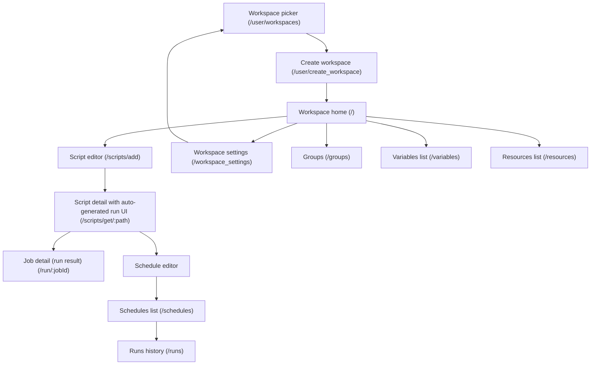

# Product specification — widndmill-test
> Generated from heal/state/spec.json — do not hand-edit. Scope: Windmill — developer platform: scripts, flows, schedules, apps

_Badges: 🟡 inferred · 🔵 documented · 🟢 confirmed · 🔴 drifted._

## Personas
- **Developer** — A new developer signing in to Windmill for the first time to write and schedule a small script. 🔵
- **Admin** — Workspace admin: can manage users, groups, settings within a workspace. 🔵
- **Operator** — Read-only / run-only workspace member: can execute scripts/flows/apps but not create or edit. 🔵
- **Superadmin** — Instance-level superadmin: manages global users, instance groups, instance settings. 🔵

## Screen-flow map

## Level-0 user journeys
### `dev-onboards-script-to-schedule` — A new developer ships a scheduled Python script end-to-end 🟢
*As a new developer, I sign in to Windmill, create a workspace, write a small Python script, run it from the auto-generated UI, schedule it on a cron, and verify the scheduled run appears in the runs history — so I can prove the platform supports the full author-to-schedule loop.*
Persona: Developer · Entry: [object Object]
1. undefined _(workspace-create)_
2. undefined _(home)_
3. undefined _(script-editor)_
4. undefined _(run-page)_
5. undefined _(job-detail)_
6. undefined _(schedule-editor)_
7. undefined _(schedules-list)_
8. undefined _(runs-history)_

## Features
### `workspaces` · Workspaces 🔴
#### `W01` · Create a new workspace from the picker and land on Home 🟢
*As a new developer with no workspace yet, I click '+ Create a new workspace' on /user/workspaces, submit a workspace name and ID, and land on the workspace home so I can use feature routes.*
Path: `workspace-picker → workspace-create → home`
1. On /user/workspaces (title 'Workspace Selection | Windmill', h1 'Select a workspace'), click the link '+ Create a new workspace'
2. On /user/create_workspace (h1 'New Workspace'), fill 'Workspace name' with 'Acme'
3. Fill 'Workspace ID' with a slug matching ^\w+(-\w+)*$ (e.g. 'acme-<rand>')
4. Click the button 'Create workspace'
5. Land on / (Workspace home) — localStorage.workspace is now set to the chosen ID
- **W01.S1** Given I am a signed-in developer with no workspace selected
And I am on /user/workspaces
When I click the '+ Create a new workspace' link
And I fill 'Workspace name' with 'Acme'
And I fill 'Workspace ID' with 'acme-<rand>'
And I click 'Create workspace'
Then I land on /
And localStorage.workspace equals 'acme-<rand>' 🟢
- **W01.S2** Given I am on /user/create_workspace
When I fill 'Workspace ID' with 'Invalid ID!'
Then the form rejects the value and the 'Create workspace' button is disabled 🟢
- **W01.S3** Given I am a non-superadmin on Community Edition
And I already own 2 workspaces outside of 'admins'
When I POST /api/workspaces/create with a new workspace
Then the request is rejected with HTTP 400
And the error reads 'You have reached the maximum number of workspaces (2 outside of default workspace \'admins\') without an enterprise license.' 🟢

#### `W02` · Pick an existing workspace from the picker 🟢
*As a developer with one or more existing workspaces, I open /user/workspaces and click a workspace tile to select it, landing on Home with that workspace as the active one.*
Path: `workspace-picker → home`
1. On /user/workspaces (h1 'Select a workspace'), under the h2 'Workspaces' section, see one button per workspace I belong to (accessible name pattern e.g. 'Admins\n-\nadmins\nas superadmin …')
2. Click the workspace tile button for the workspace I want
3. Land on / — localStorage.workspace is set to that workspace's slug
- **W02.S1** Given I am signed in and I belong to workspace 'admins'
And I am on /user/workspaces
When I click the workspace tile labeled 'Admins - admins as superadmin'
Then I land on /
And localStorage.workspace equals 'admins' 🟢

#### `W03` · Accessing a (logged) feature route without localStorage.workspace redirects to the picker 🟢
*As a developer whose browser has no localStorage.workspace yet (fresh sign-in or cleared storage), I navigate to any (logged) feature route and am redirected to /user/workspaces to select or create one first.*
Path: `workspace-picker`
1. Clear localStorage.workspace (and sessionStorage.workspace)
2. Navigate to any (logged) feature route (e.g. /scripts/add, /, /runs, /schedules, /workspace_settings)
3. Be redirected to /user/workspaces?rd=<URL-encoded-intended-route> (h1 'Select a workspace')
- **W03.S1** Given I am signed in
And localStorage.workspace is empty
When I navigate to /scripts/add
Then I land on /user/workspaces?rd=/scripts/add 🟢

#### `W04` · Edit workspace name and color from Workspace Settings 🔴
*As a workspace admin, I open /workspace_settings → General, change the workspace name and color, and see the new values reflected in the workspace selector and sidebar.*
Path: `home → workspace-settings`
1. From Home, navigate to /workspace_settings?tab=general (sidebar Settings → Workspace, or direct URL)
2. Confirm h1 'Workspace settings: <workspace-id>' and h2 'General'
3. Change the 'Workspace name' field (e.g. to 'Acme Renamed')
4. Optionally change 'Workspace color' / 'Workspace ID'
5. Save — the change is recorded server-side (audit_log kind=Update), and the workspace selector reflects the new name and color
- **W04.S1** Given I am signed in as a non-admin member of workspace 'acme'
When I navigate to /workspace_settings
Then the 'Workspace name' input is not editable (admin-only sections are hidden) undefined
- **W04.S2** Given I am a workspace admin on /workspace_settings
When I change the workspace name to 'Acme Renamed' and Save
Then POST /api/w/<id>/workspaces/change_workspace_name succeeds with 200
And an audit log entry of kind Update is recorded 🔴

#### `W05` · Add a user to the workspace (admin) 🔴
*As a workspace admin, I open Workspace Settings → Users, click 'Add new user', enter an email and pick a role, and the new member or pending invite is visible on the Users tab.*
Path: `home → workspace-settings`
1. On /workspace_settings?tab=users (default landing tab; h2 'Members (<n>)' + 'Operator settings')
2. Click the 'Add new user' button
3. Enter the user's email and pick a role (operator / developer / admin)
4. Submit the dialog — the action either adds the user immediately or sends an invite, depending on whether the email belongs to an existing Windmill user
5. On success the new row references the email in the page (member row or 'Invites' section)
- **W05.S1** Given I am a non-admin operator in workspace 'acme'
When I POST /api/w/acme/workspaces/invite_user
Then the response is HTTP 403 undefined
- **W05.S2** Given Windmill is running on Community Edition
And I am a superadmin
When I POST /api/w/admins/workspaces/invite_user with a non-admin email
Then the response is HTTP 400 with an EE-only error message undefined

#### `W06` · Leave a workspace (non-admin member) 🔴
*As a NON-ADMIN member of a workspace I no longer need, I leave it from Workspace Settings; admin owners cannot leave their own workspace and must archive or delete it instead.*
Path: `home → workspace-settings → workspace-picker`
1. Precondition: I am a non-admin member of the workspace (not the owner / admin)
2. From /workspace_settings, click the 'Leave workspace' button (only rendered for non-admin members)
3. Confirm the destructive action
4. POST /api/w/<id>/workspaces/leave returns 200; land on /user/workspaces; the workspace is no longer in my list
- **W06.S1** Given I am a NON-ADMIN member of workspace 'acme'
When I POST /api/w/acme/workspaces/leave
Then the response is HTTP 200
And my user row in workspace 'acme' is removed 🔴

#### `W07` · Archive a workspace (admin) 🟢
*As a workspace admin, I open /workspace_settings → Advanced and archive the workspace; subsequent (logged) routes for that workspace become inaccessible until a superadmin unarchives it.*
Path: `home → workspace-settings → workspace-picker`
1. On /workspace_settings?tab=advanced, click 'Archive workspace'
2. Confirm the destructive action — POST /api/w/<id>/workspaces/archive returns 200
3. Land on /user/workspaces — the workspace is hidden from non-superadmin pickers; superadmin can unarchive via POST /workspaces/unarchive/<id>
- **W07.S1** Given I am a non-admin member of workspace 'acme'
When I POST /api/w/acme/workspaces/archive
Then the response is HTTP 403 undefined
- **W07.S2** Given workspace 'acme' is archived
And I am a superadmin
When I POST /workspaces/unarchive/acme
Then the response is HTTP 200
And 'acme' reappears in the workspace picker for its members undefined

### `scripts` · Scripts (Python/TS/Go/Bash editor & runs) 🟡
#### `S01` · Author and deploy a Python script from the workspace home 🟡
*As a developer in a fresh workspace, I open the Script editor from Home, pick Python, replace the body with a no-arg hello-windmill script, and Deploy — landing on the script detail page with its auto-generated run UI.*
Path: `home → script-editor → run-page`
1. From Home, click the 'Script' CTA — /scripts/add redirects to /scripts/edit/u/<owner>/draft_<uuid>
2. In the Language picker, click 'Python'
3. Replace the editor body with `def main():\n    return 'hello windmill'` and wait for 'Saved'
4. Click the 'Deploy' button — land on /scripts/get/<scriptPath>

### `runs-and-jobs` · Runs and job history 🟡
#### `R01` · Run a deployed script from its auto-generated UI and see Success 🟡
*As a developer on a freshly deployed script, I submit the auto-generated Run form and land on the job-detail page, where the status reads Success and the result contains my script's output.*
Path: `run-page → job-detail`
1. On /scripts/get/<scriptPath>, click the 'Run' button on the auto-generated RunForm
2. Land on /run/<jobId>
3. Verify the job status reads 'Success' and the result contains 'hello windmill'

#### `R02` · Find a completed run in the runs history 🟡
*As a developer who just ran (or scheduled) a script, I navigate to /runs from the sidebar and see at least one Success row for my script in the runs history table.*
Path: `runs-history`
1. Navigate to /runs from the sidebar
2. Verify the Runs heading is visible
3. Verify at least one successful run for my script path is visible in the table (Windmill renders success as a check icon + 'Ended X ago', not a literal 'Success' label)

### `schedules` · Schedules (cron) 🟡
#### `SC01` · Schedule a deployed script on a cron from its Triggers panel 🟡
*As a developer on a deployed script, I open Triggers → Add trigger → Schedule, set a cron in the schedule editor, and save — closing the editor with the schedule attached to the script.*
Path: `run-page → schedule-editor`
1. On /scripts/get/<scriptPath>, switch to the 'Triggers' tab in the script-detail panel
2. Click 'Add trigger' and pick 'Schedule' from the chooser
3. In the schedule editor, fill the Cron textbox with '* * * * *'
4. Click 'Save' — the schedule editor heading is hidden

#### `SC02` · See a created schedule listed on /schedules 🟡
*As a developer who just created a schedule, I navigate to /schedules from the sidebar and see a row whose cron expression matches what I saved.*
Path: `schedules-list`
1. Navigate to /schedules from the sidebar
2. Verify the Schedules heading is visible
3. Verify a row referencing the saved cron expression is visible

### `users-and-permissions` · Users, groups and permissions 🟢
#### `UP01` · Add a new user to the workspace (admin) 🟢
*As a workspace admin, I open Workspace Settings → Users, click 'Add new user', enter an email and pick a role (Operator/Developer/Admin), and the user is added or invited so they can access the workspace at that role level.*
Path: `home → workspace-settings`
1. From Home, navigate to /workspace_settings?tab=users (sidebar 'Settings' → 'Workspace' → Users)
2. Click the 'Add new user' button
3. Enter the user's email and pick a role (Operator, Developer, or Admin)
4. Submit — the row references the new user's email on the Users tab
- **UP01.S1** Given I am an admin on /workspace_settings?tab=users
When I click 'Add new user'
And I fill the email with 'newop-<rand>@example.com' and pick 'Operator'
And I submit the dialog
Then a row referencing 'newop-<rand>@example.com' is visible in the Users table 🟢
- **UP01.S2** Given I am a non-admin member of workspace 'acme'
When I POST /api/w/acme/users/add
Then the response is HTTP 403 undefined

#### `UP02` · Change a workspace user's role (admin) 🟡
*As a workspace admin, I open the Users tab and click a role chip (Operator / Developer / Admin) in the row of an existing member to change their workspace role; the row reflects the new role immediately.*
Path: `home → workspace-settings`
1. On /workspace_settings?tab=users, find the row of an existing non-admin member
2. Click the role chip you want to assign (Operator / Developer / Admin) on that row
3. The selected chip becomes the active selection on the row
4. POST /api/w/<id>/users/update/<username> records the new role
- **UP02.S1** Given I am an admin on /workspace_settings?tab=users
And user 'op@example.com' has the Operator role in this workspace
When I click the 'Developer' role chip in op@example.com's row
Then the 'Developer' chip becomes the active selection on that row undefined

#### `UP03` · Self-demotion prevention — admin cannot demote themselves 🟡
*As an admin viewing my own row on the Users tab, the role chips for Operator/Developer are disabled (or block my click) so I cannot accidentally demote myself out of admin and lock myself out of the workspace.*
Path: `home → workspace-settings`
1. On /workspace_settings?tab=users, find my own row
2. Attempt to click the 'Operator' or 'Developer' role chip on my own row
3. The click is rejected or the chips are visibly disabled — my row stays at 'Admin'
- **UP03.S1** Given I am an admin viewing /workspace_settings?tab=users
When I attempt to set my own row's role to 'Operator'
Then the change is rejected (UI disabled or 'Ask another admin' prompt) undefined

#### `UP04` · Create a workspace group 🟢
*As a workspace admin, I open the Groups page, click the 'New group' popover, enter a name, and the new group appears in the groups list.*
Path: `home → groups`
1. From Home, navigate to /groups (sidebar 'Folders & Groups' → Groups)
2. On /groups (title 'Groups | Windmill', h1 'Groups'), click the 'New group' button
3. Enter a unique group name in the popover's name input
4. Submit the popover — POST /api/w/<id>/groups/create returns 201
5. A new row referencing the new group's name is visible on /groups
- **UP04.S1** Given I am an admin on /groups
When I open the new-group popover and enter 'engineers-<rand>'
And I submit the popover
Then a row referencing 'engineers-<rand>' is visible on the Groups page 🟢
- **UP04.S2** Given a group named 'engineers' already exists in workspace 'acme'
When I POST /api/w/acme/groups/create with name 'engineers'
Then the response is HTTP 4xx (conflict / unique violation) undefined

#### `UP05` · Add a member to a workspace group 🟡
*As a workspace admin, I open an existing group, add a workspace user as a member, and the member is listed in the group's roster.*
Path: `home → groups`
1. On /groups, click the row of an existing workspace group
2. In the group editor drawer, open the members section
3. Add an existing workspace user by email
4. POST /api/w/<id>/groups/adduser/<name> returns 200; the user is listed as a member
- **UP05.S1** Given workspace 'acme' contains user 'op@example.com' and group 'engineers'
And I am an admin on /groups
When I open the 'engineers' group editor
And I add 'op@example.com' as a member
Then 'op@example.com' is listed under 'engineers' members in the page undefined

#### `UP06` · Delete a workspace group 🟢
*As a workspace admin, I delete a group from the Groups page; the group row disappears from the list.*
Path: `home → groups`
1. On /groups, locate the group I want to delete
2. Open the row's dropdown / kebab menu and click 'Delete'
3. Confirm the destructive action
4. DELETE /api/w/<id>/groups/delete/<name> returns 200; the group is gone from the list
- **UP06.S1** Given group 'engineers' exists in workspace 'acme'
And I am an admin on /groups
When I open the dropdown for 'engineers' and click 'Delete'
And I confirm the action
Then the 'engineers' row is no longer visible on /groups 🟢

#### `UP07` · Toggle the auto-add (or auto-invite) setting for the workspace 🟡
*As a workspace admin, I open the Users tab and use the 'Auto-add: OFF/ON' toggle to control whether new users with a matching email domain are automatically added (or invited) to the workspace.*
Path: `home → workspace-settings`
1. On /workspace_settings?tab=users, find the 'Auto-add: OFF' or 'Auto-invite: OFF' button
2. Click it to open the popover
3. Toggle the master enable switch ON; optionally restrict by email domain and pick a default role
4. POST /api/w/<id>/settings/edit_auto_invite returns 200; the button now reads 'Auto-add: ON' (or 'Auto-invite: ON')
- **UP07.S1** Given I am an admin on /workspace_settings?tab=users with auto-add off
When I open the 'Auto-add: OFF' popover
And I enable the master toggle and pick 'Operator' as the default role
And I save the popover
Then the toggle button now reads 'Auto-add: ON' (or 'Auto-invite: ON' in cloud mode) undefined

### `variables-and-resources` · Variables and resources 🟡
#### `VR01` · Create a non-secret variable under u/<me>/ 🟡
*As a developer, I create a non-secret variable scoped to my user path (u/<me>/<name>); the variable appears in the /variables list with its value visible (non-secret).*
Path: `home → variables-list`
1. From Home, navigate to /variables (sidebar Variables)
2. Click the 'New variable' / create-variable button
3. Fill the path field with 'u/<me>/<name>' (auto-validated against ^[ug](/[\w-]+){2,}$)
4. Leave 'Secret' OFF
5. Optionally fill description and labels
6. Submit — a row referencing the new variable's path is visible in the list with the value rendered
- **VR01.S1** Given I am a developer on /variables
When I create a non-secret variable at 'u/admin/vr01-<rand>' with value 'hello'
Then a row with path 'u/admin/vr01-<rand>' is visible in the variables table
And the value column for that row shows 'hello' undefined
- **VR01.S2** Given I am on the create-variable form
When I fill the path with 'tmp/whatever' (an invalid prefix)
Then the form's path validator rejects the value and submission is blocked undefined

#### `VR02` · Create a secret variable; value is masked in the list 🟡
*As a developer, I create a secret variable; when I view the /variables list, the value column for that row is masked (e.g. shows '••••' or is blank) even though the underlying value exists.*
Path: `home → variables-list`
1. From Home, navigate to /variables
2. Click the 'New variable' button
3. Fill path 'u/<me>/<name>' and a non-empty value
4. Toggle the 'Secret' switch ON
5. Submit — the new row is visible in the list
6. Confirm the value cell for the row is masked / blank (the list endpoint returns value=null for is_secret=true)
- **VR02.S1** Given I am a developer on /variables
When I create a SECRET variable at 'u/admin/vr02-<rand>' with value 'topsecret'
Then a row with path 'u/admin/vr02-<rand>' is visible in the table
And the value cell for that row is masked (no literal 'topsecret' shown) undefined

#### `VR03` · Delete a variable 🟡
*As a developer, I delete a variable I own; the row disappears from the list.*
Path: `home → variables-list`
1. On /variables, locate the row of the variable I own
2. Open its action menu (kebab/dropdown) and click 'Delete'
3. Confirm the destructive action
4. DELETE /api/w/<id>/variables/delete/<path> returns 200; the row is no longer visible
- **VR03.S1** Given variable 'u/admin/vr03-<rand>' exists
And I am on /variables
When I open the action menu for that row and click 'Delete'
And I confirm the destructive action
Then no row with path 'u/admin/vr03-<rand>' is visible in the table undefined

#### `VR04` · Create a resource using an existing resource type 🟡
*As a developer, I create a resource of an existing type (e.g. 'postgresql') and fill its fields per the type's JSON schema; the resource appears in the /resources list.*
Path: `home → resources-list`
1. From Home, navigate to /resources (title 'Resources | Windmill'; default tab 'Workspace' shows the resources table)
2. Click the 'Add resource' button
3. In the resource editor, pick an existing resource type from the type chooser
4. Fill the SchemaForm fields required by the type
5. Submit — a row referencing the new resource's path is visible in the Resources table
- **VR04.S1** Given a resource type 'postgresql' exists in this workspace
And I am a developer on /resources (Resources tab)
When I create a new resource at 'u/admin/vr04-<rand>' of type 'postgresql' with all required fields filled
And I submit the form
Then a row with path 'u/admin/vr04-<rand>' is visible in the Resources table undefined

#### `VR05` · Delete a resource 🟡
*As a developer, I delete a resource I own; the row disappears from the Resources list.*
Path: `home → resources-list`
1. On /resources, locate the row of the resource I own
2. Open its action menu (dropdown) and click 'Delete'
3. Confirm the destructive action
4. DELETE /api/w/<id>/resources/delete/<path> returns 200; the row is gone
- **VR05.S1** Given resource 'u/admin/vr05-<rand>' of type 'postgresql' exists
And I am on /resources
When I open the action menu for that row and click 'Delete'
And I confirm the destructive action
Then no row with path 'u/admin/vr05-<rand>' is visible in the Resources table undefined

#### `VR06` · Create a workspace-scoped resource type (admin) 🟡
*As a workspace admin, I open the 'Resource Types' tab on /resources, create a new resource type with a JSON Schema, and the new type appears in the type list and is available when creating resources.*
Path: `home → resources-list`
1. On /resources, click the 'Resource Types' tab
2. Click the 'Add resource type' button
3. Fill the type name and provide a JSON Schema (object with properties)
4. Submit — POST /api/w/<id>/resources/type/create returns 200; the new type appears in the Resource Types table
- **VR06.S1** Given I am an admin on /resources → 'Resource Types' tab
When I create a new resource type named 'vr06-<rand>' with a JSON Schema {"type":"object","properties":{"host":{"type":"string"}},"required":["host"]}
Then a row referencing the new type name is visible in the Resource Types table undefined
- **VR06.S2** Given I am a non-admin developer in workspace 'acme'
When I POST /api/w/acme/resources/type/create
Then the response is HTTP 403 undefined

